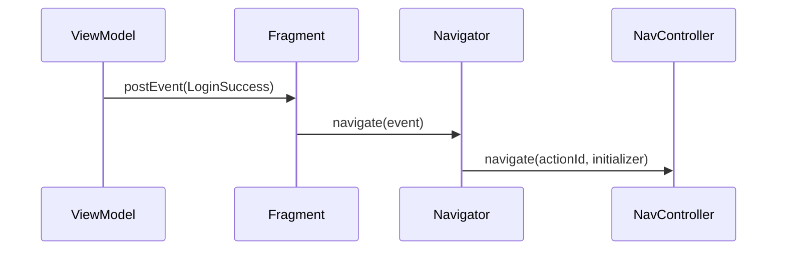

# Navegación y botón atrás

En Ema **el ViewModel nunca navega**. Publica un [evento](../concepts/events.es.md) que dice lo que ha pasado, y la vista
se lo pasa a un **navigator**, que sabe cómo moverse.



```kotlin
interface EmaNavigator<E : EmaEvent> {
    fun navigate(event: E)
    fun navigateBack(result: Any? = null): Boolean
}
```

## Fragments con el componente Navigation

Hereda de `EmaFragmentNavControllerNavigator`. Te da `navController` y `activity`.

```kotlin
class LoginNavigator(
    fragment: Fragment
) : EmaFragmentNavControllerNavigator<LoginEvent>(fragment) {

    override fun navigate(event: LoginEvent) {
        when (event) {
            is LoginEvent.LoginSuccess -> {
                navController.navigate(
                    id = R.id.action_loginFragment_to_homeFragment,
                    initializerBundle = EmaInitializerBundle(
                        HomeInitializer.HomeUser(event.user),
                        BundleSerializerStrategy.kSerialization(HomeInitializer.serializer())
                    )
                )
            }

            // Aquí se ignoran los eventos que no navegan
            is LoginEvent.Message,
            is LoginEvent.LastUserAdded -> Unit
        }
    }
}
```

El fragment expone el navigator y le reenvía los eventos que importan:

```kotlin
override val navigator: EmaNavigator<LoginEvent> = LoginNavigator(this)

override suspend fun LoginFragmentBinding.onEvent(event: LoginEvent) {
    when (event) {
        is LoginEvent.LoginSuccess -> navigate(event)
        is LoginEvent.Message -> showMessage(...)
        is LoginEvent.LastUserAdded -> showMessage(...)
    }
}
```

`navigate(event)` es una ayuda de la vista que llama a `navigator.navigate(event)`. Lanza una excepción si la vista no
tiene navigator. El navigator también tiene `navigateWithAction(actionId, data, navOptions, extras)`.

## Activity que aloja un grafo de navegación

La activity es dueña del `NavHostFragment` y usa `EmaActivityNavControllerHost`:

```kotlin
override val navigator: EmaNavigator<EmaEvent.EMPTY> = EmaActivityNavControllerHost(
    this,
    R.id.navHostFragment,
    R.navigation.main_graph
)
```

Ema asigna el grafo en `onPostCreate`, con el inicializador del intent de la activity como argumentos del destino
inicial. Para empezarlo con otro inicializador, sobrescribe `overrideDestinationInitializer()`.
Cuando el back stack se queda vacío, `navigateBack` cierra la activity.

Para escribir un navigator para una activity, hereda de `EmaActivityNavControllerNavigator`. En una activity cuyo
`NavController` gestionas tú, `EmaEmptyNavigator(activity, navController)` solo se encarga de volver atrás.

## Pasar un inicializador

Envía el [inicializador](../guides/initializers.es.md) con la extensión `navigate` del `NavController`:

```kotlin
navController.navigate(
    id = R.id.action_loginFragment_to_homeFragment,
    initializerBundle = EmaInitializerBundle(
        HomeInitializer.HomeUser(user),
        BundleSerializerStrategy.kSerialization(HomeInitializer.serializer())
    )
)
```

Un destino `<activity>` funciona como cualquier otro: el inicializador se entrega en los extras del intent.

El destino declara cómo leerlo con `initializerStrategy`:

```kotlin
override val initializerStrategy: BundleSerializerStrategy
    get() = BundleSerializerStrategy.kSerialization(HomeInitializer.serializer())
```

El inicializador llega a `onStateCreated` del ViewModel. Fuera del grafo de navegación,
`fragment.setInitializer(initializer, strategy)` lo mete en los argumentos de un Fragment.

## Resultados

La forma habitual de devolver un resultado a la pantalla anterior es un back broadcast entre ViewModels, que funciona
igual en Compose y en las vistas. Consulta [Resultados entre pantallas](../guides/results-between-screens.es.md).

Un Fragment sin navigator también puede devolver un resultado al Fragment anterior con `navigateBack(result)`. El anterior
lo recibe con `setEmaResultListener`:

```kotlin
// El fragment que se cierra
navigateBack(selectedUser)

// El fragment anterior, en onCreate
setEmaResultListener<User> { user -> viewModel.dispatch(HomeAction.UserSelected(user)) }
```

Cuando no quedan más fragments, la activity se cierra con el resultado en su intent, bajo `EMA_RESULT_KEY` y con el
código de resultado `EMA_RESULT_CODE`.

## Botón atrás

Por defecto, el botón atrás llama a `navigateBack()` de la vista:

- **Con navigator**, llama a `navigator.navigateBack()`:
  `EmaFragmentNavControllerNavigator` saca la pantalla del back stack y devuelve `false` si no había nada que sacar;
  `EmaActivityNavControllerHost` la saca y cierra la activity cuando el back stack se queda vacío.
- **Sin navigator** (`navigator = null`), un fragment saca su back stack o cierra la activity, y una activity se cierra.

No tienes que hacer nada para tener el comportamiento por defecto.

### Interceptar el botón atrás en un fragment

Activa `handleBackPressedManually` y registra tu propio listener. El listener devuelve un `EmaBackHandlerStrategy`:

| Estrategia                                     | Significado                                                 |
|------------------------------------------------|-------------------------------------------------------------|
| `EmaBackHandlerStrategy.Cancelled`             | Lo has gestionado tú; no se hace nada más.                  |
| `EmaBackHandlerStrategy.ContinueOnBackPressed` | Deja que el sistema continúe con la pulsación.              |

```kotlin
class ManualBackFragment : EmaFragment<...>() {

    override val handleBackPressedManually = true

    override fun onViewCreated(view: View, savedInstanceState: Bundle?) {
        super.onViewCreated(view, savedInstanceState)
        addOnBackPressedListener {
            viewModel.dispatch(CounterAction.BackPressed)
            EmaBackHandlerStrategy.Cancelled
        }
    }
}
```

Después decide el ViewModel: mostrar una confirmación (un diálogo en el estado) o publicar un evento que la vista
convierte en `navigateBack()`.

### Activities que se encargan del botón atrás

Una activity que aloja un grafo de navegación puede encargarse de las pulsaciones del botón atrás de sus fragments
sobrescribiendo `ownsBackDelegate = true`. Los fragments delegan entonces en `onBackDelegate()` de la activity, que vuelve
atrás mediante el navigator de la activity.
