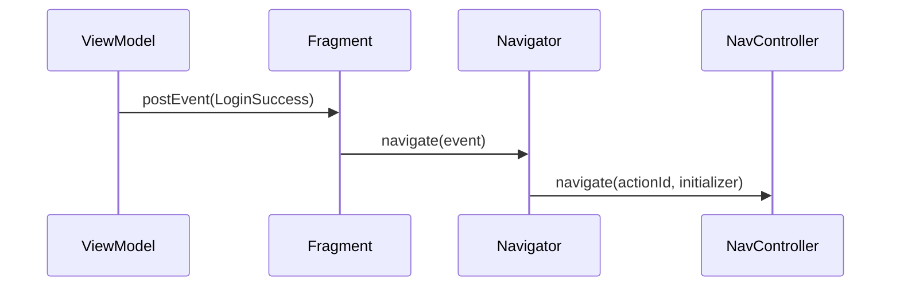

# Navigation and back handling

In Ema the **ViewModel never navigates**. It posts an [event](../concepts/events.md) that says what happened,
and the view hands that event to a **navigator**, which knows how to move around.



```kotlin
interface EmaNavigator<E : EmaEvent> {
    fun navigate(event: E)
    fun navigateBack(result: Any? = null): Boolean
}
```

## Fragments with the Navigation component

Extend `EmaFragmentNavControllerNavigator`. It gives you `navController` and `activity`.

```kotlin
class LoginNavigator(
    fragment: Fragment
) : EmaFragmentNavControllerNavigator<LoginEvent>(fragment) {

    override fun navigate(event: LoginEvent) {
        when (event) {
            is LoginEvent.LoginSuccess -> {
                navController.navigate(
                    id = R.id.action_loginFragment_to_homeFragment,
                    initializerBundle = EmaInitializerBundle(
                        HomeInitializer.HomeUser(event.user),
                        BundleSerializerStrategy.kSerialization(HomeInitializer.serializer())
                    )
                )
            }

            // Events that do not navigate are ignored here
            is LoginEvent.Message,
            is LoginEvent.LastUserAdded -> Unit
        }
    }
}
```

The fragment exposes the navigator and forwards the events that matter:

```kotlin
override val navigator: EmaNavigator<LoginEvent> = LoginNavigator(this)

override suspend fun LoginFragmentBinding.onEvent(event: LoginEvent) {
    when (event) {
        is LoginEvent.LoginSuccess -> navigate(event)
        is LoginEvent.Message -> showMessage(...)
        is LoginEvent.LastUserAdded -> showMessage(...)
    }
}
```

`navigate(event)` is a helper of the view that calls `navigator.navigate(event)`. It throws if the view has no navigator.
`navigateWithAction(actionId, data, navOptions, extras)` is also available in the navigator.

## Activity hosting a navigation graph

The activity owns the `NavHostFragment` and uses `EmaActivityNavControllerHost`:

```kotlin
override val navigator: EmaNavigator<EmaEvent.EMPTY> = EmaActivityNavControllerHost(
    this,
    R.id.navHostFragment,
    R.navigation.main_graph
)
```

Ema sets the graph in `onPostCreate`, with the initializer of the activity intent as the arguments of the start
destination. To start it with another initializer, override `overrideDestinationInitializer()`.
When the back stack is empty, `navigateBack` finishes the activity.

To write a navigator for an activity, extend `EmaActivityNavControllerNavigator`. For an activity whose `NavController`
you manage yourself, `EmaEmptyNavigator(activity, navController)` only handles going back.

## Passing an initializer

Send the [initializer](../guides/initializers.md) with the `navigate` extension of the `NavController`:

```kotlin
navController.navigate(
    id = R.id.action_loginFragment_to_homeFragment,
    initializerBundle = EmaInitializerBundle(
        HomeInitializer.HomeUser(user),
        BundleSerializerStrategy.kSerialization(HomeInitializer.serializer())
    )
)
```

An `<activity>` destination works like any other: the initializer is delivered in the intent extras.

The destination declares how to read it with `initializerStrategy`:

```kotlin
override val initializerStrategy: BundleSerializerStrategy
    get() = BundleSerializerStrategy.kSerialization(HomeInitializer.serializer())
```

The initializer reaches `onStateCreated` of the ViewModel. Outside the navigation graph, `fragment.setInitializer(initializer, strategy)`
puts it in the arguments of a Fragment.

## Results

The usual way to return a result to the previous screen is a back broadcast between ViewModels, which works the same in
Compose and in Views. See [Results between screens](../guides/results-between-screens.md).

A Fragment without navigator can also return a result to the previous Fragment with `navigateBack(result)`. The previous
one receives it with `setEmaResultListener`:

```kotlin
// The fragment that closes
navigateBack(selectedUser)

// The previous fragment, in onCreate
setEmaResultListener<User> { user -> viewModel.dispatch(HomeAction.UserSelected(user)) }
```

When there are no more fragments, the activity finishes with the result in its intent, under `EMA_RESULT_KEY` and with the
result code `EMA_RESULT_CODE`.

## Back handling

By default the back button calls `navigateBack()` of the view:

- **With a navigator**, it calls `navigator.navigateBack()`:
  `EmaFragmentNavControllerNavigator` pops the back stack and returns `false` if there was nothing to pop;
  `EmaActivityNavControllerHost` pops it and finishes the activity when the stack is empty.
- **Without a navigator** (`navigator = null`), a fragment pops its back stack or finishes the activity,
  and an activity finishes.

You do not need to do anything for the default behaviour.

### Intercepting back in a fragment

Set `handleBackPressedManually` and register your own listener. The listener returns an `EmaBackHandlerStrategy`:

| Strategy                                       | Meaning                                                     |
|------------------------------------------------|-------------------------------------------------------------|
| `EmaBackHandlerStrategy.Cancelled`             | You handled it, do nothing else.                            |
| `EmaBackHandlerStrategy.ContinueOnBackPressed` | Let the system continue the back press.                     |

```kotlin
class ManualBackFragment : EmaFragment<...>() {

    override val handleBackPressedManually = true

    override fun onViewCreated(view: View, savedInstanceState: Bundle?) {
        super.onViewCreated(view, savedInstanceState)
        addOnBackPressedListener {
            viewModel.dispatch(CounterAction.BackPressed)
            EmaBackHandlerStrategy.Cancelled
        }
    }
}
```

The ViewModel then decides: show a confirmation (a dialog in the state) or post an event that the view turns into
`navigateBack()`.

### Activities that own the back handling

An activity hosting a navigation graph can take over the back presses of its fragments by overriding
`ownsBackDelegate = true`. The fragments then delegate to the activity's `onBackDelegate()`, which goes back through the
activity's navigator.
