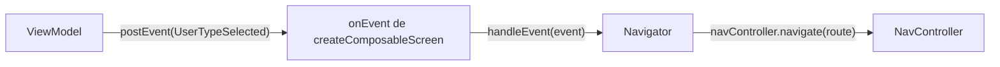

# Navegación en Compose

En Ema **el ViewModel nunca navega**. Publica un [evento](../concepts/events.es.md) que dice lo que ha pasado, y la
lambda `onEvent` del destino se lo pasa a un **navigator**, que sabe cómo moverse.



## Rutas

Cada pantalla registrada con `createComposableScreen` tiene una ruta. Por defecto es `ScreenContent::class.routeId`,
única por clase:

```kotlin
navController.navigate(ProfileCreationScreenContent::class.routeId)
```

## El navigator

La navegación vive en una clase normal que envuelve el `NavController`. Hereda de `EmaComposableNavigator` y créalo una
vez, con `remember`, junto al `NavHost`:

```kotlin
class ProfileOnBoardingNavigator(
    activity: ComponentActivity,
    navController: NavController
) : EmaComposableNavigator(context = activity, navController = navController) {

    fun handleProfileOnBoardingEvent(event: ProfileOnBoardingEvent) {
        when (event) {
            is ProfileOnBoardingEvent.UserTypeSelected -> navController.navigate(
                route = ProfileCreationScreenContent::class.routeId,
                initializerBundle = EmaInitializerBundle(
                    mapToCreationInitializer(event.role),
                    BundleSerializerStrategy.kSerialization(ProfileCreationInitializer.serializer())
                )
            )

            ProfileOnBoardingEvent.OnBoardingCancelled -> navigateBack()
        }
    }
}
```

```kotlin
setContent {
    val navController = rememberNavController()
    val navigator = remember { ProfileOnBoardingNavigator(this, navController) }

    NavHost(navController, startDestination = ProfileOnBoardingScreenContent::class.routeId) {
        createComposableScreen(
            screenContent = ProfileOnBoardingScreenContent(),
            viewModel = { get<ProfileOnBoardingViewModel>() },
            onEvent = { navigator.handleProfileOnBoardingEvent(it) }
        )
    }
}
```

`navigateBack(closeActivityWhenBackstackIsEmpty = true)` saca la pantalla del back stack y cierra la activity cuando no
queda nada. La misma función está disponible en cualquier `NavController`, y `NavController.navigateToExternalLink(url)`
abre un enlace en otra app.

## Pasar un inicializador

Envía el [inicializador](../guides/initializers.es.md) con la extensión `navigate` que recibe un `EmaInitializerBundle`:

```kotlin
navController.navigate(
    route = ProfileCreationScreenContent::class.routeId,
    initializerBundle = EmaInitializerBundle(
        ProfileCreationInitializer.Admin,
        BundleSerializerStrategy.kSerialization(ProfileCreationInitializer.serializer())
    )
)
```

Otra sobrecarga recibe una lambda `NavOptionsBuilder`, como `navigate(route) { launchSingleTop = true }`.

El destino declara cómo leerlo con `initializerSupport`. En las rutas, usa la estrategia `kSerialization`:

```kotlin
createComposableScreen(
    screenContent = ProfileCreationScreenContent(),
    viewModel = { get<ProfileCreationViewModel>() },
    initializerSupport = EmaInitializerSupport.kSerialization(ProfileCreationInitializer.serializer()),
    onEvent = { navigator.handleProfileCreationEvent(it) }
)
```

El inicializador llega a `onStateCreated` del ViewModel.

### La primera pantalla de una activity

Al destino inicial no se llega con `navigate`, así que su ruta no tiene inicializador. Cuando la activity se abre con un
inicializador en su intent, léelo y pásalo como `overrideInitializer`, que sustituye al de la ruta:

```kotlin
createComposableScreen(
    screenContent = ProfileOnBoardingScreenContent(),
    viewModel = { get<ProfileOnBoardingViewModel>() },
    initializerSupport = EmaInitializerSupport.kSerialization(
        ProfileOnBoardingInitializer.serializer(),
        getInitializer(
            BundleSerializerStrategy.kSerialization(ProfileOnBoardingInitializer.serializer()),
            savedInstanceState
        )
    ),
    onEvent = { navigator.handleProfileOnBoardingEvent(it) }
)
```

## Nodos de navegación

Para flujos en los que el ViewModel guarda el *historial* de la navegación, `EmaNavigationNode<T>` lo modela como una
lista enlazada: `next(destination, singleTop)` añade un nodo y `back()` devuelve el anterior.

`EmaComposableNodeNavigator` navega a un nodo: hacia delante, llamando a `onNavigation(event)`, o hacia atrás, cuando el
nodo ya está en el historial. Navegar dos veces al mismo nodo no hace nada.

```kotlin
class ProfileNodeNavigator(activity: Activity, navController: NavHostController) :
    EmaComposableNodeNavigator<ProfileDestination>(activity, navController) {

    override fun onNavigation(navigationEvent: ProfileDestination): Boolean {
        navController.navigate(navigationEvent.route)
        return true
    }
}

val navigator = rememberEmaNodeNavigator(navController) { activity, controller ->
    ProfileNodeNavigator(activity, controller)
}
navigator.navigate(state.navigationNode)
```

Es una opción avanzada; la mayoría de apps no la necesitan.
