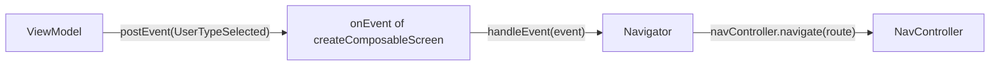

# Compose navigation

In Ema the **ViewModel never navigates**. It posts an [event](../concepts/events.md) that says what happened,
and the `onEvent` lambda of the destination hands it to a **navigator**, which knows how to move around.



## Routes

Every screen registered with `createComposableScreen` has a route. By default it is `ScreenContent::class.routeId`,
unique per class:

```kotlin
navController.navigate(ProfileCreationScreenContent::class.routeId)
```

## The navigator

Navigation lives in a plain class that wraps the `NavController`. Extend `EmaComposableNavigator` and create it once,
with `remember`, next to the `NavHost`:

```kotlin
class ProfileOnBoardingNavigator(
    activity: ComponentActivity,
    navController: NavController
) : EmaComposableNavigator(context = activity, navController = navController) {

    fun handleProfileOnBoardingEvent(event: ProfileOnBoardingEvent) {
        when (event) {
            is ProfileOnBoardingEvent.UserTypeSelected -> navController.navigate(
                route = ProfileCreationScreenContent::class.routeId,
                initializerBundle = EmaInitializerBundle(
                    mapToCreationInitializer(event.role),
                    BundleSerializerStrategy.kSerialization(ProfileCreationInitializer.serializer())
                )
            )

            ProfileOnBoardingEvent.OnBoardingCancelled -> navigateBack()
        }
    }
}
```

```kotlin
setContent {
    val navController = rememberNavController()
    val navigator = remember { ProfileOnBoardingNavigator(this, navController) }

    NavHost(navController, startDestination = ProfileOnBoardingScreenContent::class.routeId) {
        createComposableScreen(
            screenContent = ProfileOnBoardingScreenContent(),
            viewModel = { get<ProfileOnBoardingViewModel>() },
            onEvent = { navigator.handleProfileOnBoardingEvent(it) }
        )
    }
}
```

`navigateBack(closeActivityWhenBackstackIsEmpty = true)` pops the back stack and closes the activity when there is
nothing left. The same function is available on any `NavController`, and `NavController.navigateToExternalLink(url)`
opens a link in another app.

## Passing an initializer

Send the [initializer](../guides/initializers.md) with the `navigate` extension that receives an `EmaInitializerBundle`:

```kotlin
navController.navigate(
    route = ProfileCreationScreenContent::class.routeId,
    initializerBundle = EmaInitializerBundle(
        ProfileCreationInitializer.Admin,
        BundleSerializerStrategy.kSerialization(ProfileCreationInitializer.serializer())
    )
)
```

Another overload receives a `NavOptionsBuilder` lambda, like `navigate(route) { launchSingleTop = true }`.

The destination declares how to read it with `initializerSupport`. In routes, use the `kSerialization` strategy:

```kotlin
createComposableScreen(
    screenContent = ProfileCreationScreenContent(),
    viewModel = { get<ProfileCreationViewModel>() },
    initializerSupport = EmaInitializerSupport.kSerialization(ProfileCreationInitializer.serializer()),
    onEvent = { navigator.handleProfileCreationEvent(it) }
)
```

The initializer reaches `onStateCreated` of the ViewModel.

### The first screen of an activity

The start destination is not reached with `navigate`, so it has no initializer in its route. When the activity is
started with an initializer in its intent, read it and pass it as `overrideInitializer`, which replaces the one of the route:

```kotlin
createComposableScreen(
    screenContent = ProfileOnBoardingScreenContent(),
    viewModel = { get<ProfileOnBoardingViewModel>() },
    initializerSupport = EmaInitializerSupport.kSerialization(
        ProfileOnBoardingInitializer.serializer(),
        getInitializer(
            BundleSerializerStrategy.kSerialization(ProfileOnBoardingInitializer.serializer()),
            savedInstanceState
        )
    ),
    onEvent = { navigator.handleProfileOnBoardingEvent(it) }
)
```

## Navigation nodes

For flows where the ViewModel keeps the *history* of the navigation, `EmaNavigationNode<T>` models it as a linked list:
`next(destination, singleTop)` adds a node and `back()` returns the previous one.

`EmaComposableNodeNavigator` navigates to a node: forward, calling `onNavigation(event)`, or back, when the node is already
in the history. Navigating to the same node twice does nothing.

```kotlin
class ProfileNodeNavigator(activity: Activity, navController: NavHostController) :
    EmaComposableNodeNavigator<ProfileDestination>(activity, navController) {

    override fun onNavigation(navigationEvent: ProfileDestination): Boolean {
        navController.navigate(navigationEvent.route)
        return true
    }
}

val navigator = rememberEmaNodeNavigator(navController) { activity, controller ->
    ProfileNodeNavigator(activity, controller)
}
navigator.navigate(state.navigationNode)
```

It is an advanced option, most apps do not need it.
