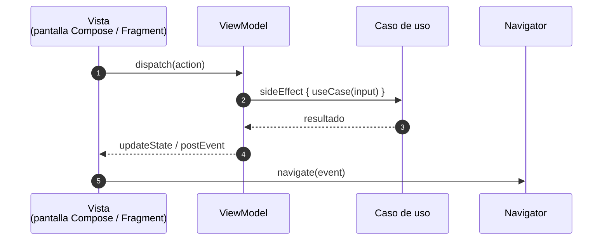
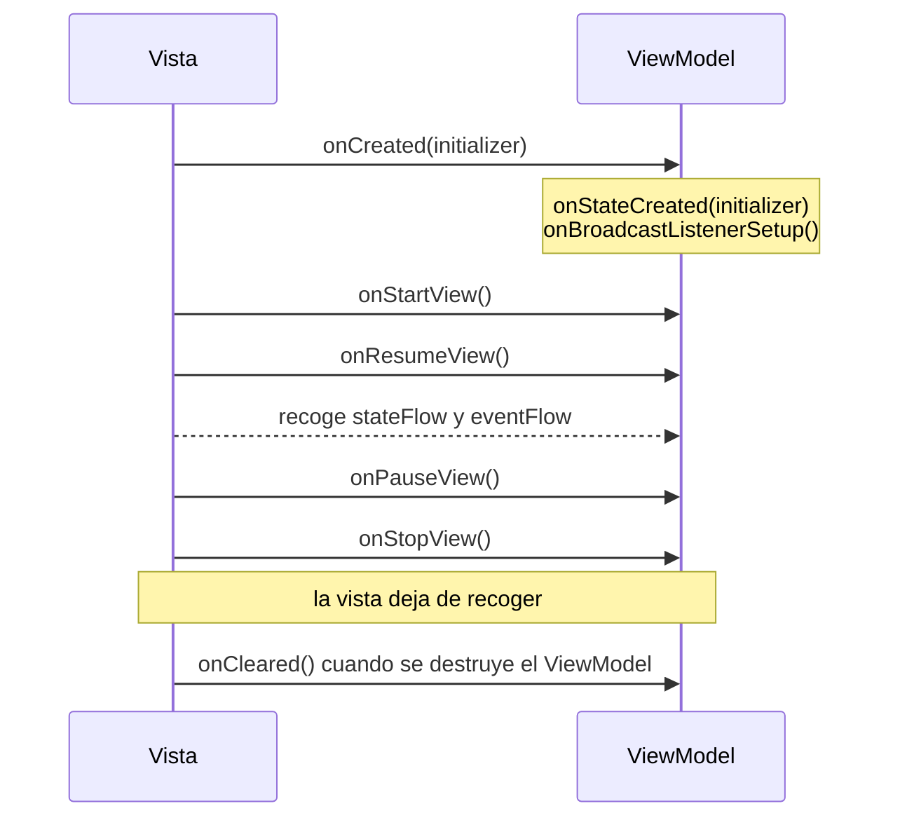

# Arquitectura

Todas las pantallas de Ema se componen de las mismas cinco piezas.

| Pieza         | Responsabilidad                                                                | ¿Conoce Android? |
|---------------|--------------------------------------------------------------------------------|------------------|
| `EmaState`    | Cómo es la pantalla en este momento.                                           | No               |
| `EmaAction`   | Lo que ha hecho el usuario.                                                    | No               |
| `EmaEvent`    | Lo que ha pasado y hay que mostrar o gestionar una vez.                        | No               |
| `EmaViewModel`| Convierte acciones en cambios de estado y eventos. Ejecuta la lógica de negocio. | No             |
| Vista         | Pinta el estado, gestiona los eventos y envía acciones.                        | Sí               |

## Las reglas

1. **La vista solo pinta e informa.** Pinta el estado y envía acciones. Nunca cambia el estado ni contiene lógica
   de negocio.
2. **El ViewModel solo cambia el estado con `updateState`.** El estado se reemplaza, nunca se modifica.
3. **Lo que perdura va en el estado; lo que ocurre una vez va en un evento.**
   Un indicador de carga o un error de validación son estado. Un snackbar o una navegación son eventos.
4. **Los eventos describen lo que ha pasado, no lo que hay que hacer.** Llámalos `LoginSuccess`, no `NavigateToHome`.
   Quien los recibe decide la reacción: el mismo evento podría abrir una pantalla en un móvil y actualizar un panel en
   una tablet.
5. **A los repositorios solo se accede desde casos de uso** (una recomendación, consulta [Recomendaciones](../recommendations.es.md)).

## ¿Estado o evento?

Es la pregunta que más te harás al construir una funcionalidad.

| Pregunta                                                   | Si la respuesta es sí → |
|------------------------------------------------------------|-------------------------|
| ¿Debería seguir ahí después de girar el dispositivo?       | Estado                  |
| ¿Debería volver a verse si el usuario vuelve a la pantalla?| Estado                  |
| ¿Es un hecho sobre algo que acaba de pasar?                | Evento                  |
| ¿Mostrarlo dos veces sería un error (toast, navegación)?   | Evento                  |

Ejemplos de la app de ejemplo:

| Qué                                        | Dónde                                  |
|--------------------------------------------|----------------------------------------|
| El nombre de usuario escrito en el login   | Estado (`LoginState.userName`)         |
| El indicador de carga del botón de login   | Estado (`LoginState.isLoading`)        |
| Diálogo de "credenciales incorrectas"      | Estado (`LoginState.overlap`)          |
| Snackbar de "Bienvenida, Ana"              | Evento (`LoginEvent.Message`)          |
| Ir a la pantalla de inicio                 | Evento (`LoginEvent.LoginSuccess`)     |

## El ciclo de vida de un vistazo

Los detalles están en [ViewModel](viewmodel.es.md).
