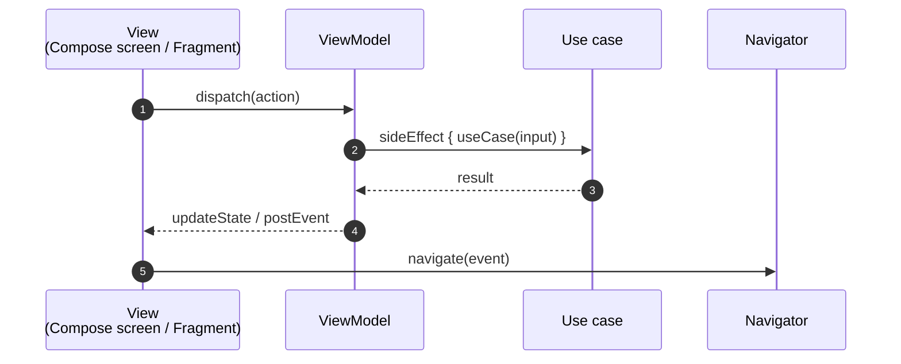
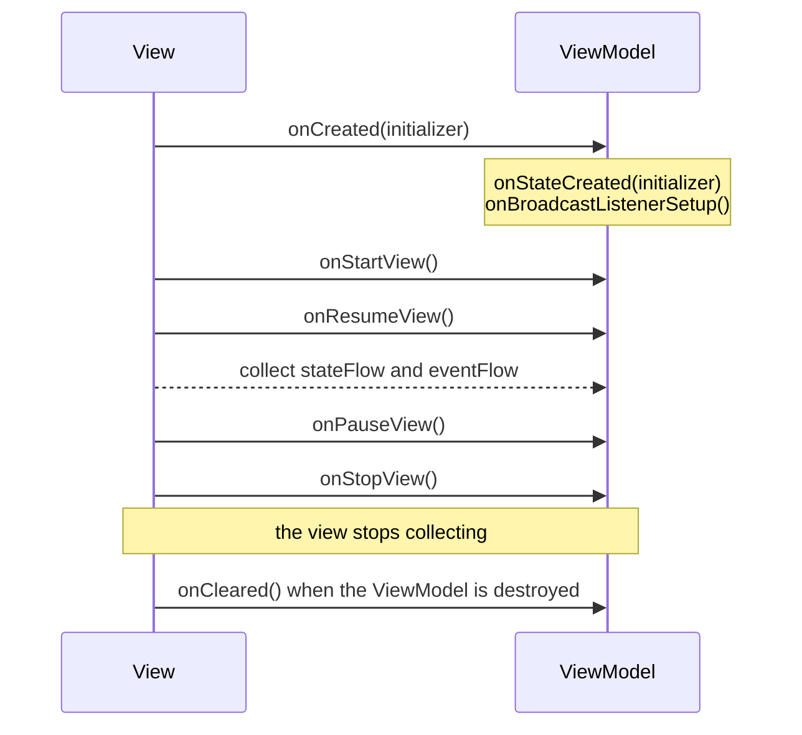

# Architecture

Every Ema screen is made of the same five pieces.

| Piece         | Responsibility                                                                 | Knows about Android? |
|---------------|--------------------------------------------------------------------------------|----------------------|
| `EmaState`    | What the screen looks like right now.                                          | No                   |
| `EmaAction`   | What the user did.                                                             | No                   |
| `EmaEvent`    | What happened and must be shown or handled once.                               | No                   |
| `EmaViewModel`| Turns actions into state changes and events. Runs the business logic.          | No                   |
| View          | Renders the state, handles events and sends actions.                           | Yes                  |

## The rules

1. **The view only renders and reports.** It renders the state and sends actions. It never changes
   the state or holds business logic.
2. **The ViewModel only changes state through `updateState`.** State is replaced, never mutated.
3. **Anything that lasts belongs in the state; anything that happens once belongs in an event.**
   A loading spinner or a validation error is state. A snackbar or a navigation is an event.
4. **Events describe what happened, not what to do.** Name them `LoginSuccess`, not `NavigateToHome`.
   The receiver decides the reaction: the same event could open a screen on a phone and update a pane on a tablet.
5. **Repositories are only accessed through use cases** (a recommendation, see [Recommendations](../recommendations.md)).

## State or event?

This is the question you will ask most often when building a feature.

| Question                                                  | If yes → |
|-----------------------------------------------------------|----------|
| Should it still be there after rotating the device?       | State    |
| Should it show again if the user comes back to the screen?| State    |
| Is it a fact about something that just happened?          | Event    |
| Would showing it twice be a bug (toast, navigation)?      | Event    |

Examples taken from the sample app:

| What                                   | Where                                  |
|----------------------------------------|----------------------------------------|
| The user name typed in the login form  | State (`LoginState.userName`)          |
| The loading spinner of the login button| State (`LoginState.isLoading`)         |
| "Wrong credentials" dialog             | State (`LoginState.overlap`)           |
| "Welcome, Ana" snackbar                | Event (`LoginEvent.Message`)           |
| Moving to the home screen              | Event (`LoginEvent.LoginSuccess`)      |

## Lifecycle at a glance

The details are in [ViewModel](viewmodel.md).
