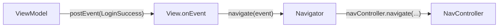

# Navigation

In Ema the **ViewModel never navigates**. It posts an [event](../concepts/events.md) that says what happened,
and the view hands that event to a **navigator**, which knows how to move around.



```kotlin
interface EmaNavigator<E : EmaEvent> {
    fun navigate(event: E)
    fun navigateBack(result: Any? = null): Boolean
}
```

## Fragments with the Navigation component

Extend `EmaFragmentNavControllerNavigator`. It gives you `navController` and `activity`.

```kotlin
class LoginNavigator(
    fragment: Fragment
) : EmaFragmentNavControllerNavigator<LoginEvent>(fragment) {

    override fun navigate(event: LoginEvent) {
        when (event) {
            is LoginEvent.LoginSuccess -> {
                navController.navigate(
                    id = R.id.action_loginFragment_to_homeFragment,
                    initializerBundle = EmaInitializerBundle(
                        HomeInitializer.HomeUser(event.user),
                        BundleSerializerStrategy.kSerialization(HomeInitializer.serializer())
                    )
                )
            }

            // Events that do not navigate are ignored here
            is LoginEvent.Message,
            is LoginEvent.LastUserAdded -> Unit
        }
    }
}
```

The fragment exposes the navigator and forwards the events that matter:

```kotlin
override val navigator: EmaNavigator<LoginEvent> = LoginNavigator(this)

override suspend fun LoginFragmentBinding.onEvent(event: LoginEvent) {
    when (event) {
        is LoginEvent.LoginSuccess -> navigate(event)
        is LoginEvent.Message -> showMessage(...)
        is LoginEvent.LastUserAdded -> showMessage(...)
    }
}
```

`navigate(event)` is a helper of the view that calls `navigator.navigate(event)`. It throws if the view has no navigator.

`navController.navigate(id, initializerBundle)` is an Ema extension that puts the [initializer](initializers.md) in the arguments.
`EmaNavControllerNavigator.navigateWithAction(actionId, data, navOptions, extras)` is also available.

## Activity hosting a navigation graph

The activity owns the `NavHostFragment` and uses `EmaActivityNavControllerHost`:

```kotlin
override val navigator: EmaNavigator<EmaEvent.EMPTY> = EmaActivityNavControllerHost(
    this,
    R.id.navHostFragment,
    R.navigation.main_graph
)
```

Ema sets the graph in `onPostCreate`. To start it with an initializer, override `overrideDestinationInitializer()`.
When the back stack is empty, `navigateBack` finishes the activity.

For an activity whose `NavController` you manage yourself, `EmaEmptyNavigator(activity, navController)` only handles going back.

## Navigating between Activities

An `<activity>` destination in the graph works like any other. The initializer you pass is delivered in the intent extras.

```kotlin
navController.navigate(
    id = R.id.action_homeFragment_to_profileActivity,
    initializerBundle = EmaInitializerBundle(
        ProfileOnBoardingInitializer.Default(event.user.name),
        BundleSerializerStrategy.kSerialization(ProfileOnBoardingInitializer.serializer())
    )
)
```

## Compose

Navigation lives in a plain class that wraps the `NavController`. It is called from the `onEvent` lambda of `createComposableScreen`.

```kotlin
class ProfileOnBoardingNavigator(
    activity: ComponentActivity,
    navController: NavController
) : EmaComposableNavigator(context = activity, navController = navController) {

    fun handleProfileOnBoardingEvent(event: ProfileOnBoardingEvent) {
        when (event) {
            is ProfileOnBoardingEvent.UserTypeSelected -> navController.navigate(
                route = ProfileCreationScreenContent::class.routeId,
                initializerBundle = EmaInitializerBundle(
                    mapToCreationInitializer(event.role),
                    BundleSerializerStrategy.kSerialization(ProfileCreationInitializer.serializer())
                )
            )

            ProfileOnBoardingEvent.OnBoardingCancelled -> navigateBack()
        }
    }
}
```

`EmaComposableNavigator.navigateBack(closeActivityWhenBackstackIsEmpty = true)` pops the stack and closes the activity when
there is nothing left. `NavController.navigateToExternalLink(url)` opens a link in the browser.

## Navigation nodes

For flows where the ViewModel keeps the *history* of the navigation, `EmaNavigationNode<T>` models it as a linked list:
`next(destination, singleTop)` adds a node and `back()` returns the previous one.
`EmaComposableNodeNavigator.navigate(node, onNavigated)` navigates forward or back depending on whether the node is already
in the history. It is an advanced option, most apps do not need it.
