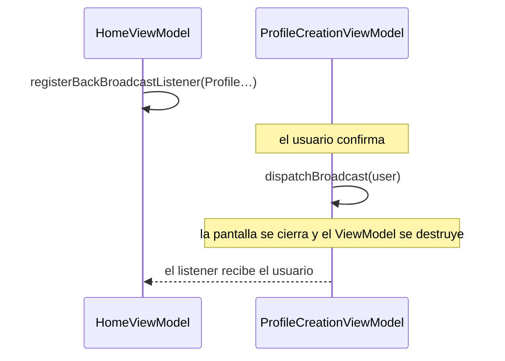

# Resultados entre pantallas

A veces una pantalla tiene que decirle algo a la anterior cuando se cierra: "he creado este usuario".
Ema lo llama **back broadcast**. Es un mensaje punto a punto, del ViewModel de una pantalla al ViewModel de otra.



## Enviar

En la pantalla que se cierra, llama a `dispatchBroadcast` con los datos:

```kotlin
private fun onActionDialogConfirmClicked() {
    hideOverlap()
    dispatchBroadcast(User(state.name, state.surname, state.role))
    postEvent(ProfileCreationEvent.DialogConfirmationAccepted)
}
```

## Recibir

En la pantalla que espera, registra un listener en `onBroadcastListenerSetup`. El id del emisor es la clase de su ViewModel:

```kotlin
override fun onBroadcastListenerSetup() {
    registerBackBroadcastListener(ProfileCreationViewModel::class.backBroadcastId) {
        val user = it as User
        updateState { copy(userList = userList + user) }
    }
}
```

## Pasarlo a lo largo de una cadena

El resultado del emisor se entrega a **un** receptor. Para reenviarlo más allá, vuelve a enviarlo desde el receptor.
En el sample, `HomeViewModel` recibe el usuario nuevo de la pantalla de creación, lo añade a su lista y llama a
`dispatchBroadcast(user)` para que `LoginViewModel` lo reciba cuando se cierre Home.

## Reglas

- **La entrega ocurre cuando se destruye el ViewModel del emisor**, es decir, cuando se cierra su pantalla.
- **Solo un receptor por emisor.** Registrar un segundo listener para el mismo emisor lanza `IllegalStateException`.
- **El resultado se guarda si todavía no hay nadie escuchando**, y se entrega cuando el receptor se registra. Esto cubre
  el caso en que la pantalla anterior se recrea después de la muerte del proceso.
- **Vive en memoria.** No se guarda si el proceso muere. Los datos son de tipo `Any?`, así que haz el cast con cuidado.

> Si el receptor reacciona mostrando algo, guarda el resultado y publica un evento desde `onViewResumed`, como hace
> `LoginViewModel`, en vez de actuar desde el listener: puede que la vista todavía no esté lista.

## Broadcasts globales

Para eventos que no dependen del cierre de una pantalla, usa el `Ema.broadcastManager` global de la app. Pásalo a las
clases que lo necesiten como un `EmaBroadcastManager`, para que en los tests puedan recibir uno falso.

```kotlin
class UserCreated(override val data: User) : EmaBroadcastEvent<User>

// Receptor (se suspende mientras escucha, así que lánzalo en una corrutina)
sideEffect {
    broadcastManager.registerBroadcast(UserCreated::class) { user -> /* ... */ }
}

// Emisor
broadcastManager.sendBroadcastEvent(UserCreated(user))
```

Los listeners tienen que registrarse antes de enviar el evento: los eventos no se repiten.
