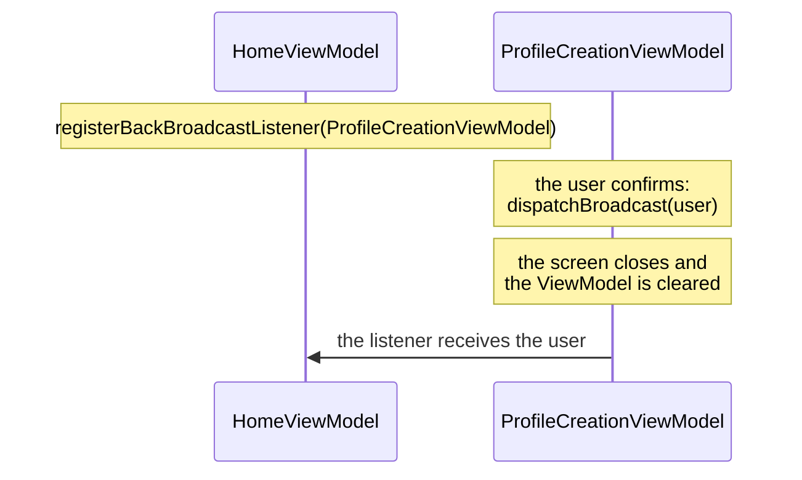

# Results between screens

Sometimes a screen needs to tell the previous one something when it closes: "I created this user".
Ema calls this a **back broadcast**. It is a point-to-point message, from the ViewModel of one screen to the ViewModel of another.



## Send

In the screen that closes, call `dispatchBroadcast` with the data:

```kotlin
private fun onActionDialogConfirmClicked() {
    hideOverlap()
    dispatchBroadcast(User(state.name, state.surname, state.role))
    postEvent(ProfileCreationEvent.DialogConfirmationAccepted)
}
```

## Receive

In the screen that is waiting, register a listener in `onBroadcastListenerSetup`. The id of the sender is its ViewModel class:

```kotlin
override fun onBroadcastListenerSetup() {
    registerBackBroadcastListener(ProfileCreationViewModel::class.backBroadcastId) {
        val user = it as User
        updateState { copy(userList = userList + user) }
    }
}
```

## Passing it along a chain

The result of the sender is delivered to **one** receiver. To forward it further, dispatch it again from the receiver.
In the sample, `HomeViewModel` receives the new user from the creation screen, adds it to its list and
calls `dispatchBroadcast(user)` so that `LoginViewModel` receives it when Home is closed.

## Rules

- **Delivery happens when the sender's ViewModel is cleared**, that is, when its screen is closed.
- **Only one receiver per sender.** Registering a second listener for the same sender throws `IllegalStateException`.
- **The result is kept if nobody is listening yet**, and delivered when the receiver registers. This covers the case
  where the previous screen is recreated after process death.
- **It lives in memory.** It is not saved if the process is killed. The data is typed `Any?`, so cast it carefully.

> If the receiver reacts by showing something, store the result and post an event from `onViewResumed`, as `LoginViewModel`
> does, instead of acting from the listener: the view may not be ready yet.

## App-wide broadcasts

For events that are not tied to a screen closing, use the app-wide `Ema.broadcastManager`. Pass it to the classes that
need it as an `EmaBroadcastManager`, so they can receive a fake in tests.

```kotlin
class UserCreated(override val data: User) : EmaBroadcastEvent<User>

// Receiver (suspends while it listens, so launch it in a coroutine)
sideEffect {
    broadcastManager.registerBroadcast(UserCreated::class) { user -> /* ... */ }
}

// Sender
broadcastManager.sendBroadcastEvent(UserCreated(user))
```

Listeners must be registered before the event is sent: events are not replayed.
