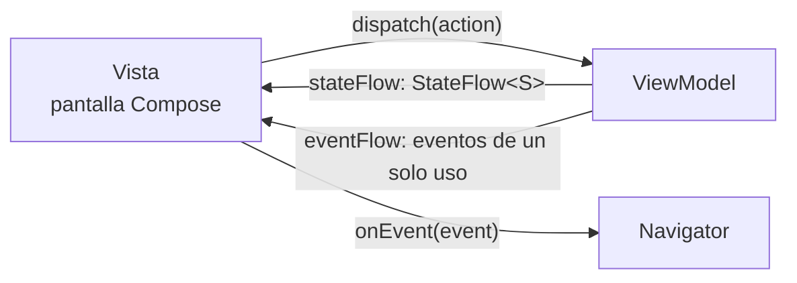

# Ema

Ema es una pequeña librería para construir pantallas con un **flujo unidireccional, de estilo MVI**.
Te da tres piezas sencillas y se encarga de todo lo que las rodea
(ciclo de vida, corrutinas, navegación, diálogos, muerte del proceso...).

| Pieza        | Qué es                                                                  | Lo que escribes                                    |
|--------------|-------------------------------------------------------------------------|----------------------------------------------------|
| **Estado**   | Una data class inmutable con todo lo que muestra la pantalla.           | `data class LoginState(...) : EmaState`            |
| **Acción**   | Algo que ha hecho el usuario.                                           | `sealed interface LoginAction : EmaAction`         |
| **Evento**   | Algo que ha pasado en la funcionalidad, entregado a la vista una vez.   | `sealed interface LoginEvent : EmaEvent`           |

La vista **pinta** el estado y **reacciona** a los eventos. Nunca decide lógica de negocio:
solo informa de lo que ha hecho el usuario mediante acciones.

## Por qué Ema

- **Una sola forma de hacer las cosas.** Todas las pantallas tienen la misma forma, así que alguien nuevo en el equipo
  puede leer cualquier funcionalidad.
- **El estado es la única fuente de verdad.** La carga, los errores y los diálogos forman parte del estado, así que girar
  el dispositivo o recrear la vista nunca los pierde.
- **Los eventos no son estado.** Los toasts, los snackbars y el "ir a la siguiente pantalla" se entregan exactamente una
  vez y nunca se repiten.
- **ViewModels en Kotlin puro.** `ema-core` es una librería Kotlin Multiplatform sin dependencias de Android, así que la
  capa de presentación se puede testear en la JVM y compartir con otras plataformas.
- **No impone un framework de inyección de dependencias.** Creas los ViewModels como prefieras.
- **Superficie pequeña.** Sin generación de código ni plugins de compilación propios.

## Módulos

| Artefacto          | Para qué sirve                                                                               |
|--------------------|----------------------------------------------------------------------------------------------|
| `ema-core`         | Estado, acciones, eventos, ViewModels y casos de uso. Kotlin Multiplatform puro.             |
| `ema-android`      | Integración con Android compartida por todas las UI: configuración, inicializadores, permisos, textos, imágenes. |
| `ema-compose`      | Pantallas, navegación y previews de Jetpack Compose. **La forma recomendada de construir la UI.** |
| `ema-android-view` | Fragments, Activities, diálogos y listas para el sistema de vistas de Android.               |

`ema-android-view` expone `ema-android`, y ambos exponen `ema-core`. Una app con Compose añade `ema-android` y `ema-compose`.

> **Compose primero.** Las pantallas nuevas deberían escribirse con Compose. El soporte del sistema de vistas está en su
> propio módulo, `ema-android-view`, y se deprecará en el futuro en favor de Compose.

## Por dónde seguir

1. **[Primeros pasos](getting-started.es.md)**: instala la librería y construye tu primera pantalla.
2. **Conceptos**: cómo encajan las piezas.
    - [Arquitectura](concepts/architecture.es.md)
    - [Estado](concepts/state.es.md)
    - [Acciones](concepts/actions.es.md)
    - [Eventos](concepts/events.es.md)
    - [ViewModel](concepts/viewmodel.es.md)
3. **Guías**: todo lo que no depende de la tecnología de UI.
    - [Configuración](guides/configuration.es.md)
    - [Inicializadores: pasar datos a una pantalla](guides/initializers.es.md)
    - [Resultados entre pantallas](guides/results-between-screens.es.md)
    - [Trabajo asíncrono y errores](guides/async-and-errors.es.md)
    - [Inyección de dependencias](guides/dependency-injection.es.md)
    - [Permisos](guides/permissions.es.md)
    - [Testing](guides/testing.es.md)
    - [Kotlin Multiplatform](guides/multiplatform.es.md)
    - [Utilidades](guides/utilities.es.md)
4. **Compose**
    - [Pantallas](compose/screens.es.md)
    - [Navegación](compose/navigation.es.md)
    - [Botón atrás](compose/back-handling.es.md)
    - [Diálogos](compose/dialogs.es.md)
    - [Guardar el estado si el proceso muere](compose/save-state.es.md)
    - [Permisos](compose/permissions.es.md)
    - [Utilidades](compose/utilities.es.md)
5. **[Vistas de Android](android-view/index.es.md)** (`ema-android-view`)
6. [Recomendaciones](recommendations.es.md): estructura del proyecto y convenciones de nombres.
7. [Contribuir](contributing.es.md): compilar, testear y formatear la librería.

> **Nota:** el código de esta guía sale de la app `sample/` de este repositorio, que puedes ejecutar para ver todo
> funcionando junto.
