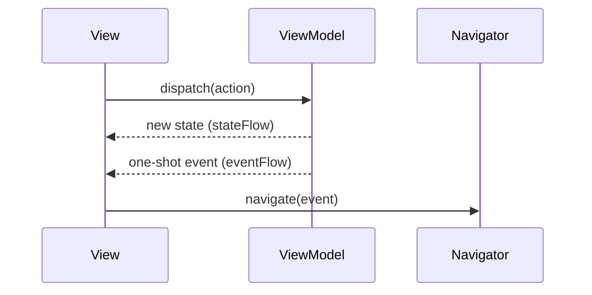

# Ema

Ema is a small library for building screens with a **unidirectional, MVI-style flow**.
It gives you three simple building blocks and takes care of everything around them
(lifecycle, coroutines, navigation, dialogs, process death...).

| Building block | What it is                                                           | You write                                          |
|----------------|----------------------------------------------------------------------|----------------------------------------------------|
| **State**      | An immutable data class with everything the screen shows.            | `data class LoginState(...) : EmaState`            |
| **Action**     | Something the user did.                                              | `sealed interface LoginAction : EmaAction`         |
| **Event**      | Something that happened in the feature, delivered to the view once.  | `sealed interface LoginEvent : EmaEvent`           |

The view **renders** the state and **reacts** to events. It never decides business logic:
it only reports what the user did through actions.

## Why Ema

- **One way to do things.** Every screen has the same shape, so a new teammate can read any feature.
- **State is the single source of truth.** Loading, errors and dialogs are part of the state, so rotating the device or
  recreating the view never loses them.
- **Events are not state.** Toasts, snackbars and "go to the next screen" are delivered exactly once and never replayed.
- **ViewModels in pure Kotlin.** `ema-core` is a Kotlin Multiplatform library with no Android dependency, so the
  presentation layer can be tested on the JVM and shared with other platforms.
- **Small surface.** No code generation and no custom build plugins.

## Modules

| Artifact           | Use it for                                                                                   |
|--------------------|----------------------------------------------------------------------------------------------|
| `ema-core`         | State, actions, events, ViewModels and use cases. Pure Kotlin Multiplatform.                 |
| `ema-android`      | Android integration shared by every UI: configuration, initializers, permissions, texts, images. |
| `ema-compose`      | Jetpack Compose screens, navigation and previews. **The recommended way to build the UI.**  |
| `ema-android-view` | Fragments, Activities, dialogs and lists for the Android View system.                       |

`ema-android-view` exposes `ema-android`, and both expose `ema-core`. A Compose app adds `ema-android` and `ema-compose`.

> **Compose first.** New screens should be written with Compose. The View system support lives in its own module,
> `ema-android-view`, and will be deprecated in favour of Compose in the future.

## Where to go next

1. **[Getting started](getting-started.md)**: install the library and build your first screen.
2. **Concepts**: how the pieces fit together.
    - [Architecture](concepts/architecture.md)
    - [State](concepts/state.md)
    - [Actions](concepts/actions.md)
    - [Events](concepts/events.md)
    - [ViewModel](concepts/viewmodel.md)
3. **Guides**: everything that does not depend on the UI technology.
    - [Configuration](guides/configuration.md)
    - [Initializers: passing data to a screen](guides/initializers.md)
    - [Results between screens](guides/results-between-screens.md)
    - [Async work and errors](guides/async-and-errors.md)
    - [Dependency injection](guides/dependency-injection.md)
    - [Permissions](guides/permissions.md)
    - [Testing](guides/testing.md)
    - [Kotlin Multiplatform](guides/multiplatform.md)
    - [Utilities](guides/utilities.md)
4. **Compose**
    - [Screens](compose/screens.md)
    - [Navigation](compose/navigation.md)
    - [Back handling](compose/back-handling.md)
    - [Dialogs](compose/dialogs.md)
    - [Saving state across process death](compose/save-state.md)
    - [Permissions](compose/permissions.md)
    - [Utilities](compose/utilities.md)
5. **[Android Views](android-view/index.md)** (`ema-android-view`)
6. [Recommendations](recommendations.md): project structure and naming conventions.
7. [Contributing](contributing.md): building, testing and formatting the library.

> **Note:** the code in this guide comes from the `sample/` app of this repository, which you can run
> to see everything working together.
