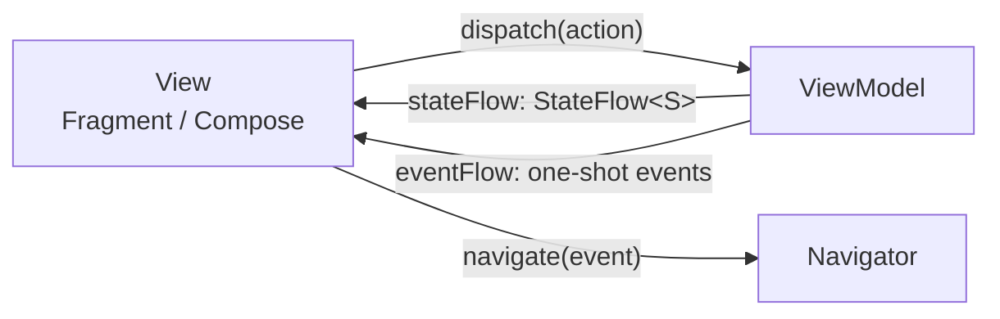

# Ema

Ema is a small Android library for building screens with a **unidirectional, MVI-style flow**.
It gives you three simple building blocks and takes care of everything around them
(lifecycle, coroutines, navigation, dialogs, process death...).

| Building block | What it is                                                          | You write                              |
|----------------|---------------------------------------------------------------------|----------------------------------------|
| **State**      | An immutable data class with everything the screen shows.           | `data class LoginState(...) : EmaState` |
| **Action**     | Something the user did.                                             | `sealed interface LoginAction : EmaAction.Screen` |
| **Event**      | Something that happened in the feature, delivered to the view once. | `sealed interface LoginEvent : EmaEvent` |

The view **renders** the state and **reacts** to events. It never decides business logic:
it only reports what the user did through actions.

## Why Ema

- **One way to do things.** Every screen has the same shape, so a new teammate can read any feature.
- **State is the single source of truth.** Loading, errors and dialogs are part of the state, so rotating the device or recreating the view never loses them.
- **Events are not state.** Toasts, snackbars and "go to the next screen" are delivered exactly once and never replayed.
- **Works with Views and Compose**, and both can live in the same app.
- **Small surface.** No code generation and no custom build plugins.

## Modules

| Artifact           | Module                  | Use it for                                                                           |
|--------------------|-------------------------|--------------------------------------------------------------------------------------|
| `ema-core`         | `ema-core`              | State, actions, events, ViewModel, use cases. Pure Kotlin, no Android dependency.   |
| `ema-android`      | `ema-android`           | Activities, Fragments, navigators, Koin setup, dialogs, lists, permissions.         |
| `ema-compose`      | `ema-android-compose`   | Compose screens, navigation graph helpers, previews.                                |

`ema-android` already exposes `ema-core`. `ema-compose` needs `ema-android` too.

## Where to go next

1. **[Getting started](getting-started.md)**: install the library and build your first screen.
2. **Concepts**: how the pieces fit together.
    - [Architecture](concepts/architecture.md)
    - [State](concepts/state.md)
    - [Actions](concepts/actions.md)
    - [Events](concepts/events.md)
    - [ViewModel](concepts/viewmodel.md)
3. **Guides**: how to do each thing.
    - [Views with XML](guides/xml-views.md) and [Compose](guides/compose.md)
    - [Navigation](guides/navigation.md) and [back handling](guides/back-handling.md)
    - [Initializers: passing data to a screen](guides/initializers.md)
    - [Results between screens](guides/results-between-screens.md)
    - [Dialogs](guides/dialogs.md)
    - [Async work and errors](guides/async-and-errors.md)
    - [Dependency injection](guides/dependency-injection.md)
    - [Saving state across process death](guides/save-state.md)
    - [Permissions](guides/permissions.md)
    - [Lists](guides/lists.md)
    - [Testing](guides/testing.md)
    - [Utilities](guides/utilities.md)
4. [Recommendations](recommendations.md): project structure and naming conventions.
5. [Migrating from 6.x](migration-from-6.md)

> **Note:** the code in this guide comes from the `sample/` app of this repository, which you can run
> to see everything working together.
