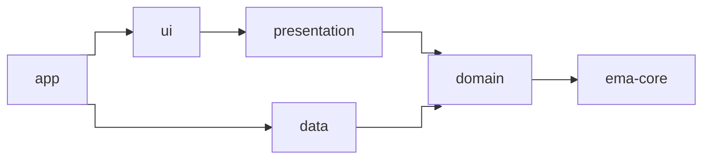

# Recomendaciones

Nada de esto lo exige Ema, pero así está organizada la app `sample/` y funciona bien.

## Divide la app en módulos

| Módulo          | Contiene                                                                         | Tipo          | Depende de                         |
|-----------------|----------------------------------------------------------------------------------|---------------|------------------------------------|
| `app`           | La `Application`, la configuración de la inyección de dependencias y el manifest. | App Android  | Todo                               |
| `ui`            | Composables, fragments, activities, navigators, adapters, diálogos, tema y recursos. | Librería Android | `presentation`, `android-utils`, `ema-compose`, `ema-android-view` |
| `presentation`  | Estado, acciones, eventos, inicializadores y ViewModels.                         | **Kotlin puro** | `domain`                         |
| `domain`        | Modelos, casos de uso e interfaces de los repositorios.                          | **Kotlin puro** | `ema-core`                       |
| `data`          | Implementaciones de los repositorios, red y almacenamiento.                      | Librería Android | `domain`, `android-utils`       |
| `android-utils` | Ayudas de Android compartidas por varios módulos.                                | Librería Android |                                 |



El diagrama no incluye `android-utils`, que usan `ui` y `data`.

Mantener `presentation` sin Android tiene dos ventajas:

- **El compilador hace cumplir la arquitectura.** Un ViewModel no puede usar `Context`, recursos ni vistas por error,
  porque el módulo no los tiene.
- **Está preparado para Kotlin Multiplatform.** `ema-core` es multiplataforma, así que `presentation` y `domain` pueden
  convertirse en módulos multiplataforma y compartir los ViewModels con otras plataformas. Consulta
  [Kotlin Multiplatform](guides/multiplatform.es.md).

## Organiza por funcionalidad

Cada pantalla es un paquete en `presentation` y otro en `ui`, con el mismo nombre:

```
presentation/…/presentation/login/        ui/…/ui/login/
├── LoginState.kt                          ├── LoginScreenContent.kt (o LoginFragment.kt)
├── LoginAction.kt                         └── LoginNavigator.kt
├── LoginEvent.kt
├── LoginOverlap.kt
├── LoginViewModel.kt
└── LoginInitializer.kt   (solo si la pantalla recibe datos)
```

## Nombres

| Tipo             | Convención                              | Ejemplo                          |
|------------------|-----------------------------------------|----------------------------------|
| Estado           | `<Pantalla>State`                       | `HomeState`                      |
| Estado por defecto | `companion object { val DEFAULT }`    | `HomeState.DEFAULT`              |
| Acción           | `<Pantalla>Action`, con el nombre de lo que hizo el usuario | `UserNameWritten`, `ProfileClicked` |
| Evento           | `<Pantalla>Event`, con el nombre de lo que pasó | `LoginSuccess`, `OnBoardingCancelled` |
| ViewModel        | `<Pantalla>ViewModel`                   | `LoginViewModel`                 |
| Diálogos en el estado | `<Pantalla>Overlap`                | `LoginOverlap.ErrorBadCredentials` |
| Funciones que gestionan las acciones | `onAction<Qué>`     | `onActionLogin()`                |
| Contenido de Compose | `<Pantalla>ScreenContent`           | `ProfileCreationScreenContent`   |
| Inicializador    | `<Pantalla>Initializer`                 | `HomeInitializer.HomeUser`       |

## Crea clases base

Define una sola vez el comportamiento que comparten todas las pantallas. El sample tiene un `BaseScreenComposable` para
sus pantallas de Compose, que pinta los diálogos que necesitan todas, y un `BaseViewModel` en `presentation`:

```kotlin
abstract class BaseScreenComposable<S : EmaState, A : EmaAction, E : EmaEvent> :
    EmaComposableScreenContent<S, A, E> {

    @Composable
    protected fun ShowDialog(data: SimpleDialogData, listener: SimpleDialogListener) { /* ... */ }

    @Composable
    protected fun ShowError(data: ErrorDialogData, listener: ErrorDialogListener) { /* ... */ }

    @Composable
    protected fun ShowLoading(loadingDialogData: LoadingDialogData? = null) { /* ... */ }
}
```

```kotlin
abstract class BaseViewModel<S : EmaState, A : EmaAction, E : EmaEvent>(initialDataState: S) :
    EmaViewModelAction<S, A, E>(initialDataState)
```

Un `BaseViewModel`, aunque esté vacío, te da un único sitio donde añadir algo más adelante. Con las vistas de Android,
un `BaseFragment` cumple el mismo papel que `BaseScreenComposable`, con los proveedores de diálogos y los mensajes.

## Mantén limpio el ViewModel

- Nada de `Context`, `View` ni recursos de Android. Usa [`EmaText`](guides/utilities.es.md#ematext-textos-que-puede-guardar-el-viewmodel)
  para los textos.
- Los repositorios solo se usan desde los casos de uso, nunca directamente desde un ViewModel.
- Los casos de uso tienen una sola responsabilidad y reciben una única data class `Input`.
- Pon los valores derivados en el estado (`val showCreateButton get() = ...`), no en la vista.
- La vista no llama a más funciones del ViewModel que `dispatch`.

## Comparte una paleta

Mientras una app tenga pantallas en Compose y con vistas, define los colores una vez en los recursos y léelos desde los
dos temas. El `EmaSampleTheme` del sample construye su `ColorScheme` de Compose a partir de los mismos recursos
`palette_*` que el tema XML, incluida la variante oscura en `values-night`.

## Textos

Pon el idioma por defecto en `values/` y las traducciones en `values-xx/`. Mantén juntos los textos de cada pantalla y
ponles el nombre de la pantalla como prefijo: `login_title`, `home_empty_message`.
