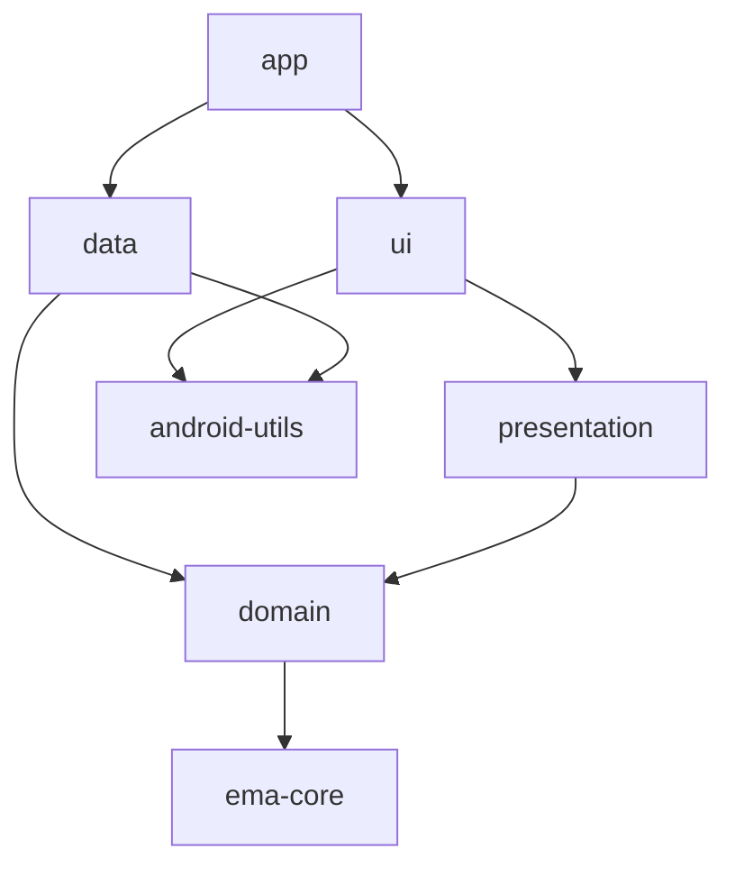

# Recommendations

None of this is required by Ema, but it is how the `sample/` app is organised and it works well.

## Split the app into modules

| Module          | Contains                                                                         | Type          | Depends on                         |
|-----------------|----------------------------------------------------------------------------------|---------------|------------------------------------|
| `app`           | The `Application`, the dependency injection setup and the manifest.              | Android app   | Everything                         |
| `ui`            | Composables, fragments, activities, navigators, adapters, dialogs, theme and resources. | Android library | `presentation`, `android-utils`, `ema-compose`, `ema-android-view` |
| `presentation`  | State, actions, events, initializers and ViewModels.                             | **Pure Kotlin** | `domain`                         |
| `domain`        | Models, use cases and repository interfaces.                                     | **Pure Kotlin** | `ema-core`                       |
| `data`          | Repository implementations, network and storage.                                 | Android library | `domain`, `android-utils`        |
| `android-utils` | Android helpers shared by several modules.                                       | Android library |                                  |



Keeping `presentation` free of Android has two benefits:

- **The compiler enforces the architecture.** A ViewModel cannot use `Context`, resources or views by mistake, because the module
  does not have them.
- **It is ready for Kotlin Multiplatform.** `ema-core` is multiplatform, so `presentation` and `domain` can become
  multiplatform modules and share the ViewModels with other platforms. See [Kotlin Multiplatform](guides/multiplatform.md).

## Organise by feature

Each screen is a package in `presentation` and another one in `ui`, with the same name:

```
presentation/…/presentation/login/        ui/…/ui/login/
├── LoginState.kt                          ├── LoginScreenContent.kt (or LoginFragment.kt)
├── LoginAction.kt                         └── LoginNavigator.kt
├── LoginEvent.kt
├── LoginOverlap.kt
├── LoginViewModel.kt
└── LoginInitializer.kt   (only if the screen receives data)
```

## Naming

| Type             | Convention                              | Example                          |
|------------------|-----------------------------------------|----------------------------------|
| State            | `<Screen>State`                         | `HomeState`                      |
| Default state    | `companion object { val DEFAULT }`      | `HomeState.DEFAULT`              |
| Action           | `<Screen>Action`, named after what the user did | `UserNameWritten`, `ProfileClicked` |
| Event            | `<Screen>Event`, named after what happened | `LoginSuccess`, `OnBoardingCancelled` |
| ViewModel        | `<Screen>ViewModel`                     | `LoginViewModel`                 |
| Dialogs in state | `<Screen>Overlap`                       | `LoginOverlap.ErrorBadCredentials` |
| Handlers in the ViewModel | `onAction<What>`               | `onActionLogin()`                |
| Compose content  | `<Screen>ScreenContent`                 | `ProfileCreationScreenContent`   |
| Initializer      | `<Screen>Initializer`                   | `HomeInitializer.HomeUser`       |

## Create base classes

Define the behaviour that every screen shares once. The sample has a `BaseScreenComposable` for its Compose screens,
which draws the dialogs every screen needs, and a `BaseViewModel` in `presentation`:

```kotlin
abstract class BaseScreenComposable<S : EmaState, A : EmaAction, E : EmaEvent> :
    EmaComposableScreenContent<S, A, E> {

    @Composable
    protected fun ShowDialog(data: SimpleDialogData, listener: SimpleDialogListener) { /* ... */ }

    @Composable
    protected fun ShowError(data: ErrorDialogData, listener: ErrorDialogListener) { /* ... */ }

    @Composable
    protected fun ShowLoading(loadingDialogData: LoadingDialogData? = null) { /* ... */ }
}
```

```kotlin
abstract class BaseViewModel<S : EmaState, A : EmaAction, E : EmaEvent>(initialDataState: S) :
    EmaViewModelAction<S, A, E>(initialDataState)
```

An (even empty) `BaseViewModel` gives you a single place to add something later. With Android Views, a `BaseFragment`
plays the same role as `BaseScreenComposable`, with the dialog providers and the messages.

## Keep the ViewModel clean

- No `Context`, `View` or Android resources. Use [`EmaText`](guides/utilities.md#ematext-strings-the-viewmodel-can-hold) for strings.
- Repositories are only used from use cases, never from a ViewModel directly.
- Use cases have one job and take a single `Input` data class.
- Put derived values in the state (`val showCreateButton get() = ...`), not in the view.
- The view does not call ViewModel functions other than `dispatch`.

## Share one palette

While an app has screens in Compose and in Views, define the colours once in resources and read them from both themes.
The sample's `EmaSampleTheme` builds its Compose `ColorScheme` from the same `palette_*` resources as the XML theme,
including the dark variant in `values-night`.

## Strings

Provide the default language in `values/` and translations in `values-xx/`. Keep every screen's strings together
and prefix them with the screen: `login_title`, `home_empty_message`.
