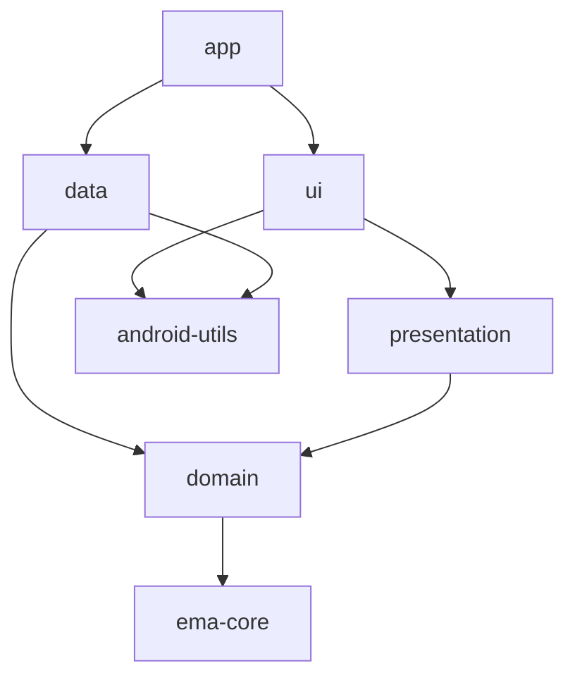

# Recommendations

None of this is required by Ema, but it is how the `sample/` app is organised and it works well.

## Split the app into modules

| Module          | Contains                                                                         | Type          | Depends on                         |
|-----------------|----------------------------------------------------------------------------------|---------------|------------------------------------|
| `app`           | The `Application`, the Koin modules and the manifest.                            | Android app   | Everything                         |
| `ui`            | Fragments, activities, composables, navigators, adapters, dialogs, theme and resources. | Android library | `presentation`, `android-utils`, `ema-android`, `ema-compose` |
| `presentation`  | State, actions, events, initializers and ViewModels.                             | **Pure Kotlin** | `domain`                         |
| `domain`        | Models, use cases and repository interfaces.                                     | **Pure Kotlin** | `ema-core`                       |
| `data`          | Repository implementations, network and storage.                                 | Android library | `domain`, `android-utils`        |
| `android-utils` | Android helpers shared by several modules.                                       | Android library |                                  |



Keeping `presentation` free of Android has two benefits:

- **The compiler enforces the architecture.** A ViewModel cannot use `Context`, resources or views by mistake, because the module
  does not have them.
- **It is a step towards Kotlin Multiplatform.** The ViewModels could be shared with other platforms in the future.
  Today `ema-core` is a JVM library, so a full KMP setup would also need a multiplatform version of it.

## Organise by feature

Each screen is a package in `presentation` and another one in `ui`, with the same name:

```
presentation/…/presentation/login/        ui/…/ui/login/
├── LoginState.kt                          ├── LoginFragment.kt      (or LoginScreenContent.kt)
├── LoginAction.kt                         └── LoginNavigator.kt
├── LoginEvent.kt
├── LoginOverlap.kt
├── LoginViewModel.kt
└── LoginInitializer.kt   (only if the screen receives data)
```

## Naming

| Type             | Convention                              | Example                          |
|------------------|-----------------------------------------|----------------------------------|
| State            | `<Screen>State`                         | `HomeState`                      |
| Default state    | `companion object { val DEFAULT }`      | `HomeState.DEFAULT`              |
| Action           | `<Screen>Action`, named after what the user did | `UserNameWritten`, `ProfileClicked` |
| Event            | `<Screen>Event`, named after what happened | `LoginSuccess`, `OnBoardingCancelled` |
| ViewModel        | `<Screen>ViewModel`                     | `LoginViewModel`                 |
| Dialogs in state | `<Screen>Overlap`                       | `LoginOverlap.ErrorBadCredentials` |
| Handlers in the ViewModel | `onAction<What>`               | `onActionLogin()`                |
| Compose content  | `<Screen>ScreenContent`                 | `ProfileCreationScreenContent`   |
| Initializer      | `<Screen>Initializer`                   | `HomeInitializer.HomeUser`       |

## Create base classes

The sample defines the behaviour that every screen shares once: `BaseFragment` in `ui` and `BaseViewModel` in `presentation`.

```kotlin
abstract class BaseFragment<B : ViewBinding, S : EmaState, VM : EmaViewModel<S, E>, E : EmaEvent> :
    EmaFragment<B, S, VM, E>() {

    private val appDialogProvider: AppDialogProvider by inject { parametersOf(childFragmentManager) }

    protected fun showError(data: ErrorDialogData, listener: ErrorDialogListener) { /* ... */ }
    protected fun showMessage(message: String) { /* Snackbar */ }
    protected fun hideDialog() = appDialogProvider.hide()
}
```

```kotlin
abstract class BaseViewModel<S : EmaState, A : EmaAction.Screen, E : EmaEvent>(initialDataState: S) :
    EmaViewModelAction<S, A, E>(initialDataState)
```

An (even empty) `BaseViewModel` and `BaseScreenComposable` give you a single place to add something later.

## Keep the ViewModel clean

- No `Context`, `View` or Android resources. Use [`EmaText`](guides/utilities.md#ematext-strings-the-viewmodel-can-hold) for strings.
- Repositories are only used from use cases, never from a ViewModel directly.
- Use cases have one job and take a single `Input` data class.
- Put derived values in the state (`val showCreateButton get() = ...`), not in the view.
- The view does not call ViewModel functions other than `dispatch`.

## Share one palette

If you use XML and Compose in the same app, define the colours once in resources and read them from both themes.
The sample's `EmaSampleTheme` builds its Compose `ColorScheme` from the same `palette_*` resources as the XML theme,
including the dark variant in `values-night`.

## Strings

Provide the default language in `values/` and translations in `values-xx/`. Keep every screen's strings together
and prefix them with the screen: `login_title`, `home_empty_message`.
