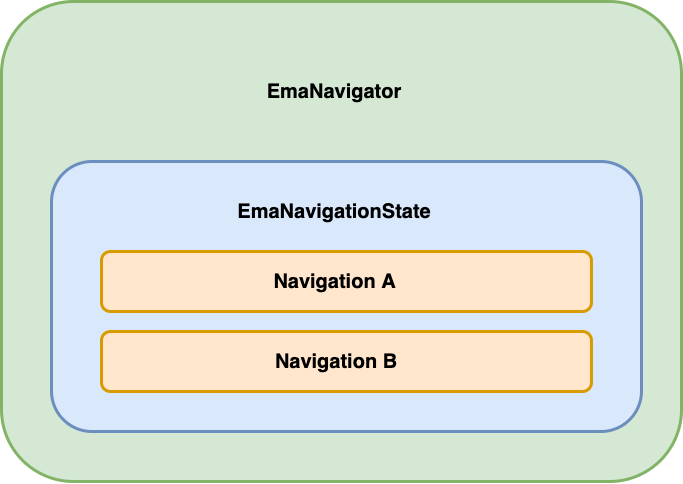
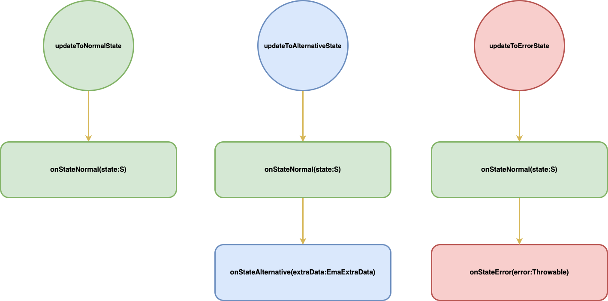
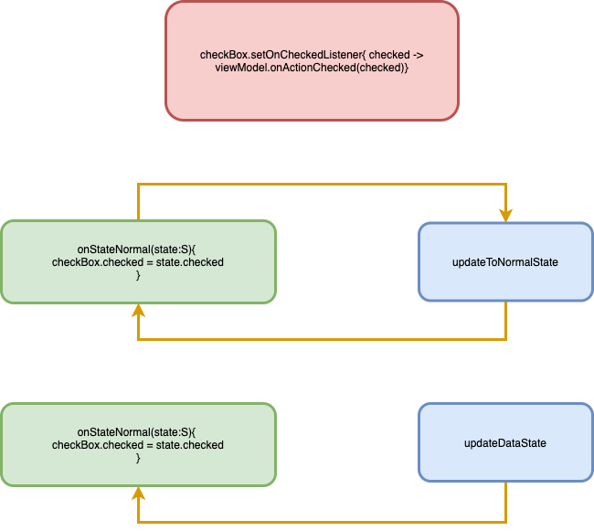
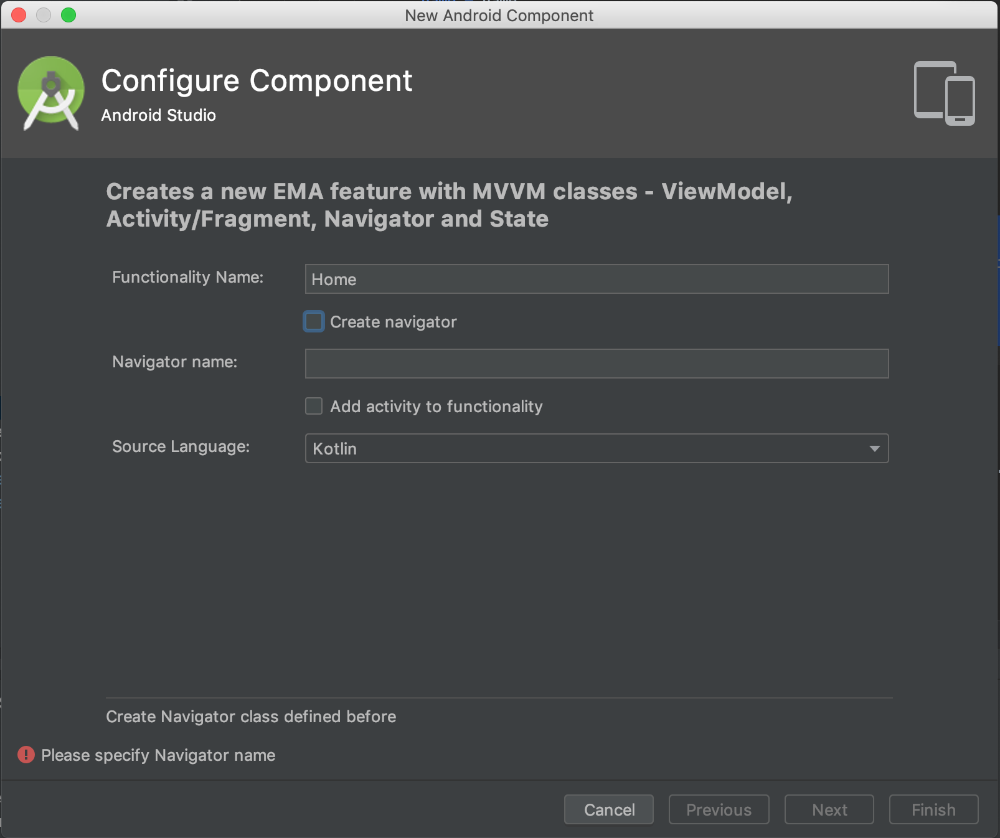

# EMA V2

**EMA** is a library to implement the architecture of an Android app by an easy and confortable way, getting an structured code, testable and maintaneable, and using the patterns recommended by Android Team. The library is based on :

**Kotlin:** The library has been created using Kotlin language.

**Dependency injection:** The dependency injection to provide the app models is based on Kodein modules.

**Navigation patterns:** With the navigation classes provided, you can navigate between screens through the [Navigation Architecture Component](https://developer.android.com/guide/navigation/navigation-getting-started).

**MVVM architecture:** The communication between data providers and visual components is based on MVVM reactive pattern through [ViewModel](https://developer.android.com/topic/libraries/architecture/viewmodel), using the ***Single State Concept<mark>*** as unique source of truth for view drawing.

**Coroutines:** All concurrency tasks are handle by Kotlin coroutines.

> 
>  ***Single State Concept:***  All dynamic data a screen needs to draw itself, must be saved in an unique object.
> > 

## The basics

**EMA** is based on ***<mark>Single State Concept</mark>***, so if there is a change in configuration or other action that needs an activity/fragment rebuilts, the state will be saved and it will be used to restore the state of the view.

### <a name="ema-state">EMA STATES</a>

**EMA** allows the followings states:

* **NORMAL:** It will be used to set the normal state of the screen, for example the data that is usually shown to the user.

* **ALTERNATIVE:** It should be used to show an alternative state, for example, when a loading or confirmation dialog is shown to the user.

* **ERROR:** It is used to handle the visual state when an error has been produced.

>
>***The feature can have only one of these states, <mark>passing always through NORMAL state</mark> just before in case of ALTERNATIVE/ERROR states, this way the NORMAL data state is always drawn if a activity/fragment recreation is launched.***
>
 

The states <mark>must be **data classes** with **invariable** attributes *(val)*</mark> to avoid changes from the view. If they have to be modified, it would be inside ***EmaViewModel*** through **copy operator**. 

They must implement as well **EmaBaseState** class and all its attributes must be **Serializables**

~~~kotlin
data class SampleLoginState(
	val userName:String,
	val password:String,
	val remembered:Boolean
) : EmaBaseState
~~~

### <a name="ema-navigation">EMA NAVIGATION</a>
To handle the navigation between different screens **EMA** has an ***EmaNavigator*** class  based on [Navigation Architecture Component](https://developer.android.com/guide/navigation/navigation-getting-started).

The navigation will be handled by a class where all possible destinations availables will be implemented by an ***EmaNavigationState***. They should be the implementation of a sealed class called Navigation.

~~~kotlin
class LoginNavigator(override val navController: NavController) :
EmaNavigator<LoginNavigator.Navigation> {

    sealed class Navigation : EmaNavigationState {

        object HomeFromLogin : Navigation() {
            override fun navigateWith(navigator: EmaBaseNavigator<out EmaNavigationState>) {
                val nav = navigator as LoginNavigator
                nav.toHomeLoginFromLogin()
            }
        }

        class SettingFromLogin(private val state:SettingsState) : Navigation() {
            override fun navigateWith(navigator: EmaBaseNavigator<out EmaNavigationState>) {
                val nav = navigator as LoginNavigator
                nav.toSettingsFromLogin(state)
            }
        }
        
    private fun toHomeLoginFromLogin() {
        navigateWithAction(R.id.action_loginViewFragment_to_homeViewFragment)
    }
    
    private fun toSettingsFromLogin(state: SettingsState) {
        navigateWithAction(
        		R.id.action_loginViewFragment_to_settingsViewFragment,
        		addInputState(state)
        )
    }
}
~~~

  

It has support for the following features:

* **Back navigation:** 
	
	With ***navigateBack()*** method, it will pop up the last fragment to 	navigate to previous fragment.

* **Navigation based on action IDs or NavDirections:**

	To navigate between different actions you can use:

	* **navigateWithAction**:

		You can set the id of the navigate action from [Navigation Component Graph](https://developer.android.com/guide/navigation/navigation-design-graph).
	 
		~~~ kotlin
		fun navigateWithAction(
	 		@IdRes actionID: Int,		// Graph action ID
	  		data: Bundle?,  			// Bundle to pass data to next screen
	  		navOptions: NavOptions? 	// Nav options
		)
		
	 
	* **navigateWithDirections**
	 
		You can use a ***NavDirections*** object if you are using [Safe Args](https://developer.android.com/guide/navigation/navigation-pass-data#Safe-args) 
	 
	 	~~~ kotlin
		fun navigateWithDirections(
	 		navDirections: NavDirections,	// Nav direction object to navigate
	 		navOptions: NavOptions?			// Nav options
	 	)
    
	
* **Set the default state of the next screen:**

	As we said before, **EMA** is based on states to represent the view, so you can set the state of the new screen before navigate to it with ***addInputState***. You can use it to generate the ***Bundle*** argument in **navigateWithAction** method commented before. 
	
	~~~ kotlin
	fun addInputState(
			emaBaseState: EmaBaseState,	//State of next screen
			inputStateKey: String   	//Key of bunlde in next screen, class name by default
	): Bundle 
	~~~
	
	Example:
	
	~~~ kotlin
	navigateWithAction(R.id.action_login_to_user,addInputState(UserState())
	~~~
	
>
> ***The input state of the new screen <mark>only can be setted independently if the next screen is a fragment or activity</mark>***
>	

### <a name="ema-usecases">EMA USE CASES</a>

***EmaUseCase*** is where the CRUD data logic should be implemented. It accepts an object as **input** data and return an **output** data.

The main features of ***EmaUseCase*** are:

* **They are always launched in a background thread:**

 You can choose the background thread overriding ***dispatcher*** property. The default one is **Dispatchers.IO**. 
 
 
 [See availables](https://kotlin.github.io/kotlinx.coroutines/kotlinx-coroutines-core/kotlinx.coroutines/-dispatchers/index.html)

* **It receives always an input model and returns an output model:** 

	If the input model is not needed, you should put Unit as parameter.
	
	
	>
	>**Due to EmaUseCases are launched in a background thread, they have to be created inside a Coroutines scope.**
	>

	~~~ kotlin
		
	class LoginUseCase(private val serverRepository: ServerRepository)
 	: EmaUseCase<RequestLoginModel, ResponseLoginModel>() {

    		override suspend fun useCaseFunction(loginRequestModel:RequestLoginModel): ResponseLoginModel {
			val response = serverRepository.login(loginRequestModel)
        		return response
		}
    
    		/// OVERRIDE ONLY IF YOU WANT THE BACKGROUND THREAD. The default is Dispatchers.IO
    		override dispatcher = Dispatchers.Main
	}
	

### <a name="ema-viewmodel">EMA VIEW MODEL</a>

This is one of the most powerfull class of **EMA**, with the ***EmaFragment/EmaActivity***.

It is the **wrapper of the View State** and allows to manipulate it by a reactive way
sending events to all the views that have been suscribed to it.

All the **presentation logic** of the applicacion should be **implemented in this class**. It <mark>**survives to configuration changes** </mark>so the views binded to it, will maintain the state when fragment/activity is recreated, for example, in a rotation.

These are the main features of ***EmaViewModel***:

* **Set view states:**
	- **Set NORMAL state for the view:**

		With ***updateToNormalState()*** you can change the current state of the view.
	Inside the body of the function the ***@this*** pointer will give you access to 	the current state of the view, and you will have to **return the new state**, for example with the **copy** operator, due to **EmaStates** should be ***data*** classes.
	
		~~~kotlin
	 	updateToNormalState {
            copy(
                		userName = "Sample User Name",
                		remembered = !remembered                    
            )
   		}
  	 	~~~
   
  		The view will be notified with the userName as *"Sample User Name"* and
  		remembered with the opposite value saved before.
	
		
	-  **Set ALTERNATIVE state for the view:**
		
		With ***updateToAlternativeState()*** you can set an alternative state for the view passing ***EmaExtraData*** if it is needed for the alternative data.
		> 
		***EmaExtraData*** is provided by dafault with the following parameters:
		
		>* ***type*** = ***0***
		
		>* ***extraData*** =  ***null***
		> 
	
		~~~ kotlin
 		updateToAlternativeState(
 			EmaExtraData(
 				type:Int,
 				extraData:Any?
 			)
 		)
		
	
	- **Set ERROR state for the view:**

		With ***updateToErrorState*** you can set an error state for the view passing the ***Throwable*** which 		determine the exception to nofity.
	
		~~~ kotlin
		updateToErrorState(exception: Throwable)
		~~~
	
	**States Flow**

	

* **Update data state:**	
	With ***updateDataState()*** you can update the internal state of the view (inside the viewmodel) but the <mark> view will not be notified</mark> . This is  useful when you want to save the state of a view, for example a ***CheckBox***, which itself changes it visual state to checked/unchecked and you want retain it if there is a configuration change as rotation without create an infinite loop.
	
	~~~ kotlin
 	checkDataState{ state ->
 		// some code 
 	}
	~~~ 
	>
	**Example:**
	>	
	**A checkBox has a listener to notify the *ViewModel* the user has checked the button (it is >updated to check/uncheck automatically):** 
	>
	>* **The *ViewModel* updates the view with updateToNormalState()**
	>* **The view is notified and the checkbox is updated again**
	>* **The listener call again ViewModel**
	>* **The *ViewModel* notify the view**
	>* **<mark>INFINITE LOOP !!</mark>**
		 	
	>
	 
	

* **Notify single events:**

   Due to the nature of ***ViewModel***, if a fragment/activity recreation happens, the last **ViewModel State** will be invoked once the view is attached.

	>  
	**For example:**
	 
	>
	**If the last state of the ViewModel was the ALTERNATIVE state, the *onStateAlternative()* method of the fragment/activity attached will be executed after recreation.**
	
	To avoid this fact, the developer can use the ***notifySingleEvent()*** to execute logic that only has like 	a ***Toast***, then if a fragment/activiy is recreated, the ***Toast*** will not be executed again.
   
    ~~~ kotlin
   notifySingleEvent(data:EmaExtraData)
    ~~~	
	
* **Launch tasks in background**

	With ***executeUseCase()*** and ***executeUseCaseWithException()*** you will execute all code inside the lambda function in a background thread through coroutines. You could ***change the state to any (NORMAL/ALTERNATIVE/ERROR)*** with no problem because these coroutines are executed in ***Dispatchers.Main*** so you will not receive the exception :

     ~~~ kotlin	
	  android.view.ViewRoot$CalledFromWrongThreadException: 
	  Only the original thread that created a view hierarchy can touch its views.
     ~~~
	 
	
	* **With no exception:** 
	
	~~~kotlin
	executeUseCase{ 
		//THE BLOCK TO HANDLE THE LOGIC IN BACKGROUND THREAD
                   
       val responseLogin  = loginUseCase
                   				.execute(requestLogin)
                   				.await()
       updateToNormalState()  
       
    }
	~~~
    
	* **With exception handling:**
	 
	~~~ kotlin
	  executeUseCaseWithException(
                {  //THE BLOCK TO HANDLE THE LOGIC IN BACKGROUND THREAD
                   
                   val responseLogin  = loginUseCase
                   							.execute(requestLogin)
                   							.await()
                   updateToNormalState()  
                },
                {   // THE BLOCK TO HANDLE THE EXCEPTION
                		
                		e ->                      
                    		updateToErrorState(e)
                }
    )
    ~~~
    
    
* **Navigate to other screens**

	To navigate to other screen you can use the ***navigate*** function:

	~~~kotlin
 	navigate(navigationState: EmaNavigationState)
 	~~~

	You have to pass as argument an object that implements ***EmaNavigationState*** interface, it should implemented by a sealed class as you can see in [EMA NAVIGATION](#ema-navigation). This way the developer only could choose the available navigations from the screen, and all the navigation implementation logic is in the same place.
	
* **Navigate back**

	Use this method to navigate to the previous fragment. 
	
	~~~kotlin
 	navigateBack()
 	~~~
 	
 	If it is the last fragment, you could check the result of navigateBack() overriding it on an [EmaFragment](#ema-view) child and finish the activity if you would want navigate to the previous activity.
 	
* **Set results**
	
	There is a common task that an activity or fragment to set a result data for previous fragments/activities. To set a result for previous views, use the method:
	 
	 ~~~kotlin
	 addResult(data:Serializable,code:Int)
	 ~~~
	 
	 The ***data*** must be serializable and the ***code*** is the identifier for the result in previous views.
	 
	 To listen the result in previous fragment/activities you should set a listener overriding this method of its viewmodel and add the result receiver inside it:
	 
	 ~~~kotlin
	override fun onResultListenerSetup(){
	 		addOnResultReceived(RESULT_IDENTIFIER)			{ emaResult ->
        		val data = emaResult.data
        		///Update the view with the data for example
       	}
    }
     ~~~	
    
    	
    >* Code is not mandatory, if it is not setted it uses a default one.
    >* When a resultReceived is called, the result is consumed, you need to set the result again if you want to use in other previous fragments/activity viewmodel.
    >* If there is a resultReceived listener with same code at the same level, for example, in the fragment and its content activity, the last created one has priority, in this case, only the fragment viewmodel result receiver will be executed.
    	

	The result ***<mark>can be listened on any previous fragment/activity viewmodel on the stack</mark>***, not only the last one. These fragments/activites must be inherit from *EmaFragment/EmaActivity* and in case of add a result receiver listener in an activity, the ***EmaActivity must be launched with the following method*** in ***EmaNavigator***.
	
	
	~~~kotlin
	fun navigateToEmaActivityWithResult(mainEmaActivity: Activity, destinationEmaActivity: Intent, finishMain: Boolean = false) 
	~~~
    

* **Control start lifecyle flow**

	We can access to the start control flow to make the proper logic according to the requeriments. This start flow is attached to the scope of the view model that we explain in [EMA FRAGMENT](#ema-view).

	- **onStartFirstTime**

		This method is called only the first time the fragment/activity is created, if there is a recreation due to a configuration change, or the fragments/activities goes from background to foreground, this method is **not** called.

		In resume, the method is called **only** when the fragment/activity is **added to the stack**.
		
		As argument has a boolean called statePreloaded that means if the state has been set up by the previous view.
		
		~~~kotlin
 		onStartFirstTime(statePreloaded:Boolean)
 		~~~
		
	- **onResume**

		This method is called every time this fragment/activity goes to foreground, so every logic the developer wants to be executed at this time, should be implemented here overriding the method.

		Examples when it is called:
 
		* There is a configuration  change, like rotation.
		* Fragment goes from background to foreground.
		
		As argument has a boolean called firsTime that means if it is the first time that onResume is called.
		
		~~~kotlin
 		onResume(firstTime:Boolean)
 		~~~
	
	
*	**EMA Fragment Lifecycle**
	
	
	
*	**EMA Activity Lifecycle**
	
	

### <a name="ema-view_fragment">EMA FRAGMENT/EMA ACTIVITY</a>

This class handles all the data provided by the [EMA VIEWMODEL](#ema-viewmodel) to show it in the view.

All the view **data assignation** must be done here, as the **binding between** the view **listeners** and their corresponding methods in the **ViewModel**.

The main features of ***EmaFragment*** are:

* **<a name="ema-viewmodel-initalized">Access to the viewmodel</a>**

    In **onInitalized(viewModel:VM)** method we can access to the viewmodel attached to the fragment/activity. 
    
    Here should go the view setup logic:
    
   * Binding between view listeners and viewmodel methods.
   * View setup methods: Setup programatically view parameters that couldn't been set up by XML. 

	Example:
	
   ~~~kotlin
    override fun onInitialized(viewModel: EmaHomeViewModel) {
        setupButtons(viewModel)
        setupDialog(viewModel)
    }

    private fun setupDialog(viewModel: EmaHomeViewModel) {
        errorDialog.dialogListener  = object : SimpleDialogListener {
            override fun onCancelClicked() {
                viewModel.onActionDialogErrorCancel()
            }

            override fun onBackPressed() {
                viewModel.onActionDialogErrorCancel()
            }

            override fun onConfirmClicked() {
                viewModel.onActionDialogErrorAccept()
            }

        }
    }

    private fun setupButtons(viewModel: EmaHomeViewModel) {
        swLightLoginRememberPassword.setOnCheckedChangeListener { _,isChecked -> viewModel.onActionRemember(isChecked) }
        ivHomeTouchEmptyUser.setOnClickListener { viewModel.onActionDeleteUser() }
        ivHomePassEmptyPassword.setOnClickListener { viewModel.onActionDeletePassword() }
        ivHomePassSeePassword.setOnClickListener { viewModel.onActionShowPassword() }
        ......
    }
      
   
   ~~~
    
* **Handle states provided by *EmaViewModel* through different methods:**

	- **onStateNormal(data:S):**
	
		Here it should go the view assignation data. 
		
		>For animations or expensive view operations you can use <mark>***bindForUpdate/bindForUpdateWithPrevious***</mark> method that allow you to execute an operation only if an attribute of the state has been changed.
		
		>As argument you only have to put the state attribute with :: sintax and it will check if the state is different than previous one and will execute the action.
		
		>Example:
		>
		 ~~~kotlin
		 override fun onNormal(data: EmaHomeState) {
         	bindForUpdate(data::userPassword) { newPasssword ->
            		etPassword.setText(newPassword)
          }
          /* To access to previous values use this
          bindForUpdateWithPrevious(data::userPassword) { oldPassword,newPasssword ->
            		etPassword.setText(newPassword)
          }
          */
		 ~~~
		
		> This will set the editText etPassword data only if userPassword attribute has changed.
		
	
	- **onStateAlternative(data:EmaExtraData):**
	
		The logic relative to alternative view states, for example, when a dialog is shown, should be implemented here.
	
	- **onStateError(error:Throwable):**
	 
	 	When error is received, it should be handled here and represented by the proper way defined by the developer.
	 
   - **onSingleEvent(data:EmaExtraData):**
   
	 	Logic that developer wants to be executed only once, like a *Toast*, should be done here.
	 
		>
		**Example launching Normal State:**
	
		>* **ViewModel sets the Normal State.**
		>* **There is a recreation of the fragment/activity.**
		>* **The logic of Normal State is executed again.**
	
		>
		**Example launching Single Event:**
		
		>* **ViewModel launchs a Single Event.**
		>* **There is a recreation of the fragment/activity.**
		>* **The previous state is executed (Normal/Alternative/Error).**

	 
* **<a name="ema-viewmodel-scope">Define the scope of ViewModel</a>**

	Overriding the ***fragmentViewModelScope*** we can define if the **ViewModel** is <mark>attached to the activity or fragment lifecycle</mark>.

	Depending its value the viewmodel lifecycle is the following:

	- ***fragmentViewModelScope*** **= TRUE**

		The **ViewModel is attached to the fragment**, so it is created when the fragment is created and destroyed the the fragment is destroyed.
	
	- ***fragmentViewModelScope*** **= FALSE**

		The **ViewModel is attached to the activity**, so it is created when the activity is created and destroyed the the activity is destroyed. This can be used as well to share data between fragments due to the activity viewmodel attached to the activity will be kept in memory until the activity is destroyed.
		
* **<a name="ema-viewmodel-add-extra">Add additional ViewModels</a>**

	A fragment can need to listen events from its parent class container or other view, for example the updates of an activity toolbar, for that reason **extra ViewModels** can be attached to the fragment. To do that, you can use the method:

	 ~~~kotlin
	 addExtraViewModel(viewModel : EmaViewModel,fragment : Fragment, activity : FragmentActivity,observerFunction: ((attachedState: EmaState<AS>) -> Unit)
	 ~~~
	 
	You must provide the **currentFragment**, the **parent activity** if you want to use the **viewmodel with activityScope <mark>(shared viewmodel)</mark>**,  and the listener function which will receive the extra **ViewModel** state updates, and the method will return the view model attached, this way you can use it if you want to **modify some behaviour defined in the parent container class ViewModel**.
		

### <a name="ema-activity">EMA ACTIVITY</a>

**EMA** follows the Android Team patterns so it recommends use a single activity app as fragment container.

There are three types of activities availables:

* **EmaFragmentActivity**

	Is an activity with support for [Android Navigation Library] (https://developer.android.com/guide/navigation/navigation-getting-started). 
	
	The main features of ***EmaFragmentActivity*** are:
	
	* **<a name="ema_activity_fragment_navigation">Handle Android Navigation Library</a>**

		You don't need to provide a layout, this class has a default one with a ***NavHostFragment*** to support fragment navigation through the **navigation graph**, so you only has to provide the ***default navigation graph resource***.
	
		The default layout is an empty layout with the ***navHost*** fragment container, so if you want to override the layout for custom design, it <mark>must have a ***NavHostFragment*** container identified by ***id : navHostFragment***.</mark>
	
	
* **EmaToolbarFragmentActivity**
	
	It has the same feature of ***EmaFragmentActivity*** but with toolbar support. 
	
	The main features of ***EmaToolbarFragmentActivity*** are:
	
	* **<a name="ema_activit_toolbar_fragment_navigation">Handle Android Navigation library</a>**
	
		Due to it extends form ***EmaFragmentActivity***, it has support for fragment navigation.
	
	* **<a name="ema_activity_toolbar_fragment_toolbars">Handle toolbar</a>**
	
		You can manipulate the visibility of the toolbar with ***showToolbar()*** and ***hideToolbar()*** methods, set the title overriding the method ***setToolbarTitle(title:String)***, and access to the ***toolbar(Toolbar)*** and ***toolbarLayout(AppBarLayout)*** properties for more advance customizations.

		
		In this case, the default layout is an empty layout, but with a toolbar layout, so if you want to override the layout for custom design, you <mark>must provide additionally in the layout a ***Toolbar*** identified by ***id : emaToolbar*** and an ***AppBarLayout*** identified by ***id : emaAppBarLayout***</mark>.
		
	>
	**If it possible attach a viewmodel for activity extending from *EmaView*, but we will explain it on [EmaViewDeclaration](#ema-view_declaration)**
	
		
* **EmaActivity**

	It is the EmaToolbarFragmentActivity with the viewmodel attached, it has the same behaviour and features than EmaFragment, so read [EMA FRAGMENT](#ema-view_fragment) to know all features.
	
	As ***additional feature***, you can add a 
result handler from other activities with the method:

	~~~kotlin
	fun addOnActivityResultHandler(requestCode: Int, function: (Int, Int, Intent?) -> Unit)
	
	//requestCode -> The code for next activity result
	//function -> The onActivityResult arguments for  that request code
	~~~
	
	

## Implementation

Once we have explained all the features EMA is based on, now we will explain how we can bind all these elements they work properly.

### <a name="ema-app_declaration">EMA APP DECLARATION</a>

To use all the feature of **EMA** architecture, you must extends the app from ***EmaApplication*** class.

~~~kotlin
class EmaSampleApplication : EmaApplication() {
    override fun injectAppModule(kodein: Kodein.MainBuilder): Kodein.Module? = null
}
~~~
>
We could provide a **app module scope** for dependency injection if it is needed.

Therefore, we must declare the class in the manifest:

~~~xml
<manifest xmlns:android="http://schemas.android.com/apk/res/android"
          xmlns:tools="http://schemas.android.com/tools"
          package="com.carmabs.ema">

    <application
        android:name="es.carmabs.ema.presentation.EmaSampleApplication"
        ....>
        ..........
        ..........
        
    </application>

</manifest>
~~~

### <a name="ema-view_declaration">EMA VIEW DECLARATION</a>

This is the class <mark>responsible for binding between view and **ViewModel**</mark>. This is automatically implemented in [EmaFragment](#ema-view_fragment), but you can use it to add this feature to any view.

You must implement the following interface:

~~~kotlin
interface EmaView<S: EmaBaseState, VM : EmaViewModel<S, NS>, NS : EmaNavigationState> {

    val viewModelSeed: VM
    
    val navigator: EmaBaseNavigator<NS>?
    
    fun onViewModelInitalized(viewModel: VM)
  
    fun onStateNormal(data: S)
       
    fun onStateAlternative(data: EmaExtraData)

    fun onSingleEvent(data: EmaExtraData)

    fun onStateError(error: Throwable)
    
    fun onResultSetEvent(emaResultModel: EmaResultModel)

    fun onResultReceiverInvokeEvent(emaReceiverModel: EmaReceiverModel)

}
~~~

The parameters we can see on the definiton of ***EmaView<S: EmaBaseState, VM : EmaViewModel<S, NS>, NS : EmaNavigationState>*** are the following:

* **EMA STATE (S):**

	The name of the state class which will handle the data representation of the 	view.
	This state must implement the [EmaBaseState](#ema-base_state_definition) class.

* **EMA VIEW MODEL (VM):**

	The name of the  view model class which will handle the logic for the view.
	This view model must extend the [EmaViewModel](#ema-view_model_definition) class.

* **EMA NAVIGATION STATE (NS):**

	The name of the navigation state class which will handle the available navigations from the view.
	This navigation class must extend the [EmaNavigationState](#ema-navigation_state_definition) class.
	

About the attributes and methods you must override, they are the following ones:

* **override fun onResultSetEvent(emaResultModel: EmaResultModel)**

	When a result is set on a viewmodel, this event is launched.

* **fun onResultReceiverInvokeEvent(emaReceiverModel: EmaReceiverModel)**

	When a result receiver is invoked, this event is launched.

* **override val viewModelSeed: VM** 

	The **ViewModel** object used by the view must assigned here.
	<mark>This must not be used in any point in the fragment</mark>, because it is <mark>used only as seed for **ViewModel** creation</mark>, it means, if you use this view model after recreation, it will be a different view model, due to recreation of the view, so **the state will not be saved**. If you want **to use the ViewModel** in any point, you must **use the view model provided by** ***[onInitialized](#ema-viewmodel-initalized)*** method.
	
	~~~kotlin
    override val viewModelSeed: EmaUserViewModel = EmaUserViewModel()
    
    or with KODEIN
    
    override val viewModelSeed: EmaUserViewModel by instance()
    ~~~
    
* **override val navigator: EmaBaseNavigator<NS>?** 

	This is the navigator the fragment will use to navigate between different destinations. If there is no navigation in this fragment it can be set up as **null**. If you use ***KODEIN***, you <mark>must change the ***EmaBaseNavigator<NS>*** class by the proper one</mark>, this way ***KODEIN*** will detect the right assignation.
	
	~~~kotlin
    override val navigator: EmaBaseNavigator<NS> = EmaUserNavigator()
    
    or with KODEIN
    
    override val navigator: EmaUserNavigator by instance()
	~~~
	

When you implement **EmaView** interface you <mark>must call the method ***initializeViewModel***:
	
~~~kotlin
fun initializeViewModel(fragmentActivity: FragmentActivity, fragment: Fragment? = null)
~~~
	
This method **initialize** the **ViewModel** on the scope you define, for example, if you provide a ***FragmentActivity*** only, the **ViewModel** will persist during all the ***Activty*** lifecycle, if you provide as well a fragment, the **ViewModel** will persist only during the ***Fragment*** lifecyle.

The method **should be called everytime the view is shown on foreground**, for example, if you implements the **EmaView** on an **Activity**, this should be created in ***onResume*** method. 

To unbind the view for the updates when screen goes to background, you should call to the ***viewmodel unbindObservables()*** method in ***onPause()*** method, otherwise due to ***onResume() initialization***, view observers could be duplicated.

~~~kotlin
  override fun onResume {
        super.onResume()
        initializeViewModel(this)
   		 .......
    }
    
  override fun onPause(){ 
        vm.unBindObservables(this)
  }
~~~

### <a name="ema-activity_declaration">EMA ACTIVITY DECLARATION</a>

It must implement one of the following classes:
	
* **EmaFragmentActivity**

~~~kotlin
abstract class EmaFragmentActivity : EmaBaseActivity() {
  
    abstract val navGraph: Int
    
    abstract fun injectActivityModule(kodein: Kodein.MainBuilder): Kodein.Module?
}
~~~

* **EmaFragmentToolbarActivity**

~~~kotlin
abstract class EmaToolbarFragmentActivity : EmaFragmentActivity() {

  	 abstract val navGraph: Int
  	 
  	 abstract fun provideFixedToolbar(): String?
  	 
  	 abstract fun injectActivityModule(kodein: Kodein.MainBuilder): Kodein.Module?
}
~~~

Depending the class implemented, we must override the following parameters:

* **override val navGraph: Int**

	We must provide the navigation graph layout resource that [Android Navigation Library](https://developer.android.com/guide/navigation/navigation-design-graph) use to define all posible navigations.
	
* **override fun injectActivityModule(kodein: Kodein.MainBuilder): Kodein.Module?**

	The ***KODEIN*** injection module must be assigned here to provide the object assignation by ***instance()*** methods. The object defined by this module will have the **same lifecyle that the activity**.
	
	~~~ kotlin
	override fun injectFragmentModule(kodein: Kodein.MainBuilder): Kodein.Module = activityInjection(this)

	fun activityInjection(activity: Activity) = Kodein.Module(name = "ActivityModule") {

    	bind<Activity>() with singleton { activity }

     	bind<LoginNavigator>() with singleton { LoginNavigator(instance(), instance()) }

        ~~~
* **override fun provideFixedToolbarTitle(): String?**
	
	We must provide the string showed as title in the toolbar. If it is provided, the title will be fixed for all fragment independently of the label setted on the fragments in navigation layout.
	

Some <mark>**OPTIONAL**</mark> parameters to override are:
	
* **override val layoutId: Int**
	
	By default **EMA activties** provide an empty layout with the ***NavHostFragment*** container, so if you want to override the layout for custom design, it <mark>must have a **NavHostFragment** container identified by ***id : navHostFragment***</mark>.
	
	In case of ***EmaFragmentToolbarActivity***  the default layout contains as well  a toolbar layout, so if you want to override the layout for custom design, you <mark>must provide additionally in the layout a ***Toolbar*** identified by ***id: emaToolbar*** and an ***AppBarLayout*** identified by ***id : emaAppBarLayout***<mark>.
	
* **override val overrideTheme: Boolean** 

	It is set by default as ***false***. Due to **EMA** uses ***SupportActionBar*** it has a default theme set up. If you want to set a custom theme for the activity, you should override the value to ***true***.
	
* **override fun inputStateKey: String**

	By default is the state class name, but you can override it if you want. If it is overriden the input state key provided by the navigators in *addInputState* method must match with this value.

### <a name="ema-fragment_declaration">EMA FRAGMENT DECLARATION</a>

It must implement the following class:

~~~kotlin
abstract class EmaFragment<S : EmaBaseState, VM : EmaViewModel<S, NS>, NS : EmaNavigationState> 
: EmaBaseFragment(), EmaView<S, VM, NS> {

	abstract fun onInitialized(viewModel: VM)
	
	abstract val fragmentViewModelScope: Boolean 
	
	abstract val layoutId: Int 
	
	abstract fun injectFragmentModule(kodein: Kodein.MainBuilder): Kodein.Module?
}
~~~

As it implements [EmaView](#ema-view_declaration), we need implement additionally the parameters defined  by this interface.

Once we have defined the ***EmaFragment***, we must override the following parameters:
    
* **override val fragmentViewModelScope: Boolean**

	This will define the lifecycle [scope](#ema-viewmodel-scope) of the view model.
	
	~~~
	override val fragmentViewModelScope: Boolean = true
	~~~

* **override val layoutId: Int**

	You must provide the fragment layout resource ID.

	~~~
	override val layoutId: Int = R.layout.fragment_user	~~~

* **override fun injectFragmentModule(kodein: Kodein.MainBuilder): Kodein.Module?**

	The ***KODEIN*** injection module must be assigned here to provide the object assignation by ***instance()*** methods. The object defined by this module will have the **same lifecyle that the fragment**.

	~~~kotlin
	override fun injectFragmentModule(kodein: Kodein.MainBuilder): Kodein.Module = fragmentInjection(this)

	fun fragmentInjection(fragment: Fragment) = Kodein.Module(name = "FragmentModule") {

   		bind<Fragment>() with singleton { fragment }

    	bind<NavController>() with singleton { (fragment.activity as EmaHomeActivity).let { it.navController } }

    	bind<FragmentManager>() with singleton { fragment.activity!!.supportFragmentManager }

    	bind<EmaHomeNavigator>() with singleton { EmaHomeNavigator(instance()) }

    	bind<LoginUseCase>() with singleton { LoginUseCase(instance()) }

    	bind<EmaHomeViewModel>() with singleton { EmaHomeViewModel(instance()) }
	}
	~~~

### <a name="ema-viewmodel_declaration">EMA VIEW MODEL DECLARATION</a>

It must implement the following class:

~~~kotlin
abstract class EmaViewModel<S, NS : EmaNavigationState> : EmaBaseViewModel<EmaState<S>, NS>(){
		
		abstract val initialViewState: S
		
		abstract fun onStartFirstTime(statePreloaded: Boolean)
		
		abstract fun onResume(firstTime: Boolean)
}
~~~

When we create an **EMA ViewModel** we have to define 2 parameters on its declaration:

* **EMA STATE (S):**

	The name of the state class which will handle the data representation of the view.
	This state <mark>must implement the **EmaBaseState**</mark> class.

* **EMA NAVIGATION STATE (NS):**

	The name of the navigation state class which will handle the available navigations from the view.
	This navigation class <mark>must extend the **EmaNavigationState**</mark> class.
	
Example:

~~~kotlin
class EmaUserViewModel() : EmaViewModel<EmaUserState, EmaUserNavigator.Navigation>() 
~~~
	
Both <mark>must have the same type declaration that the **EmaView declaration** </mark> which it is attached.

Once we have defined the ***EmaViewModel***, we must override the following parameters:

* **override val initialViewState: S**

   Here we must provide the default state object of the ***ViewModel***.
   
    ~~~kotlin
    override val initialViewState: EmaUserState = EmaUserState()
    ~~~

* **override fun onStartFirstTime(statePreloaded: Boolean)**
 
	This method will be called only when the ***Viewmodel*** is created. It has a parameter to check if the initial view state has been provided by previous fragments through [addInputState](#ema-navigation).
	
	~~~kotlin
	override fun onStartFirstTime(statePreloaded: Boolean) {
		///LOAD INITIAL DATA
    }
   ~~~
   
* **override fun onResume(firstTime: Boolean)**
 
	This method will be called everytime the view goes to foreground. It has a parameter to check if is the first time the view has gone to foreground.
	
	~~~kotlin
	override fun onResume(firstTime: Boolean) {
		///REFRESH DATA
   }
   ~~~
   
Some ***OPTIONAL*** parameters are:

* **override val updateOnInitialization**

	Set this value as false if you want to avoid notify to the view the normal state when view model is attached.
	
* **override val onResultListenerSetup**

	Override this methos to setup the result receivers to check if a result has been sent to this model to a later viewmodel.

### <a name="ema-navigator_declaration">EMA NAVIGATOR DECLARATION</a>

It must implement the following interface:

~~~kotlin
interface EmaNavigator<NS : EmaNavigationState>{
	val navController: NavController
}
~~~
	
To create the navigator we must define 1 parameter on its declaration:

* **EMA NAVIGATION STATE (NS):**

	The name of the navigation state  class which will define the available destinations. We must provide a ***NavController* object as constructor argument.
	
Example:

~~~kotlin
class EmaUserNavigator(override val navController: NavController) 
	:EmaNavigator<EmaUserNavigator.Navigation>
~~~
	
In this case, the ***EmaNavigationState*** interface should be implemented inside the *EmaNavigator* class and should be a sealed class as we can see in [Navigation section](#ema-navigation).

### <a name="ema-state_declaration">EMA STATE DECLARATION</a>

It must implement the following interface:

~~~kotlin
interface EmaBaseState : Serializable
~~~

This class <mark>must be a ***data class***</mark> and its properties <mark>must be **invariables (val)**</mark>, this way the **ViewModel is the only responsible** to modify their values through ***copy*** data class operator, and avoid modifications from the view.

Example:

~~~kotlin
data class EmaHomeState(
        val userName: String = "",
        val userPassword: String = "",
        val showPassword: Boolean = false,
        val rememberuser: Boolean = false
) : EmaBaseState
~~~

>
**Due to *EmaBaseState* is *Serializable*, all the <mark>properties of the class must be *Serializable*</mark> as well.**

###  <a name="ema-dependency_declaration">DEPENDENCY INJECTION DECLARATION</a>

To provide dependencies, **EMA** use **KODEIN** modules. The **scopes** provided are the followings:

* **App module:**

	Here you should declare objects which **lifecycle is the whole app**.

 	For example, repositories,  database implementations, hardware managers, resource managers, app instance, should be go here.

	~~~kotlin
	fun generateAppModule(app: Application) = Kodein.Module(name = "AppModule") {

   		bind<Logger>() with singleton { TimberLogger() }

    	bind<Application>() with singleton { app }

    	bind<Resources>() with singleton { app.resources }

    	bind<Repository>() with singleton { MockRepository()
    }
	~~~

* **Activity module:**

	Here you should declare objects which **lifecycle is the activity**. When the activity is detroyed, a new instance of the object will be created the next time it is needed. 
	
	For example, navigators, activity view models, activity instance, should be go here.
	
	~~~kotlin
	fun generateActivityModule(activity: Activity) = Kodein.Module(name = "ActivityModule") 

    	//ACTIVITY//
  	 
  	 	bind<Activity>() with singleton { activity }
  	 
    	//NAV CONTROLLER//

    	bind<NavController>() with singleton { activity.navController }

    	bind<EmaHomeNavigator>() with singleton { HomeNavigator(instance(), instance()) }

    	//VIEW MODEL//

    	bind<MainToolbarsViewModel>() with provider { MainToolbarsViewModel(instance(),instance(),instance()) }

    	bind<BiometricManager>() with singleton {
        if (activity.isBiometricPromptEnabled())
            BiometricV28Manager(activity)
        else
            BiometricV23Manager(activity, BiometricDialog(activity))
    }
 
	~~~

* **Fragment module:**

	Here you should declare objects which **lifecycle is the fragment**. When the fragment is detroyed, a new instance of the object will be created the next time it is needed. 

	For example, fragment view models, fragment instance, should be go here.

	~~~kotlin
	fun generateFragmentModule(fragment: Fragment) = Kodein.Module(name = "FragmentModule") {

    	//FRAGMENT//

    	bind<Fragment>() with provider { fragment }

    	//FRAGMENT MANAGER//

    	bind<FragmentManager>() with provider { fragment.requireFragmentManager() }

    	//VIEW MODEL//

    	bind<EmaHomeViewModel>() with provider { EmaHomeViewModel(instance())}

    	bind<EmaUserViewModel>() with provider { EmaUserViewModel() }
	~~~

>
**To create an instance with the proper scope you <mark>must declare the binding in module as singleton</mark>, this way the object will be used like a local singleton for that scope, it you use provide, a new instance of the object will be created every time the object is needed**

To provide these modules, **EMA** classes provide the following methods:

* **EmaApplication:**

	~~~kotlin
	class EmaApplication() {
    
    	override fun injectAppModule(kodein: Kodein.MainBuilder): Kodein.Module?{
    	//RETURN APP KODEIN DEPENDECY MODULE
    	}
	}
	~~~

* **EmaActivity:**

	~~~kotlin
	class EmaFragmentActivity() {
    
    	override fun injectActivityModule(kodein: Kodein.MainBuilder): Kodein.Module?{
    	//RETURN ACTIVITY KODEIN DEPENDECY MODULE
    	}
	}
	~~~
	
* **EmaFragment:**
* 	
	~~~kotlin
	class EmaFragment() {
    
   		override fun injectFragmentModule(kodein: Kodein.MainBuilder): Kodein.Module?{
    	//RETURN FRAGMENT KODEIN DEPENDECY MODULE
    	}
	}
	~~~

**More modules can be added**. To do it, you can use the *kodein* object provided by the method and use the ***import*** function, it will attach the new module to the current module scope.

Example:

~~~kotlin
 	override fun injectAppModule(kodein: Kodein.MainBuilder): Kodein.Module?{
 		kodein.import((generateExtraModule()))
    	//RETURN SCOPE KODEIN DEPENDECY MODULE
    }
~~~

# ARCHITECTURE RECOMMENDATIONS

Here we give some recommendation to create robust, maintenable and testable apps by a quickly and confortable way.

## <a name="ema-architecture_divide">DIVIDE THE APP IN ANDROID MODULES</a>

To have the code better organized and avoid coupling, we recommend divide the app in the following modules, each one with its own responsability:

|     Modules  | Description  | Library Type  |
|:-------------:|:------------:|:-------------:|
| **DOMAIN**|It contains the business models, use cases and repository abstractions, so all business logic happens in this module.|Kotlin|
| **DATA**|Here are the implementation of repositories,so all the third parties used for that purpose should be implemented here.|Android|
| **COMMON**|All common resources that can be used for app/data/injection modules should be go here. For example: string resources, extension files for android framework, icons, etc.|Android|
| **INJECTION**|The binding between domain and data layer for implementation should be done here. This is the module the app will use to get the dependencies, this way, we achieve decoupling the dependency between app module and data module.|Android|
| **APP** |It is implemented by EMA features (Activity/Fragment, ViewModels,States)|Application|

* **Module dependencies (Vertical):**

|              	 |**DOMAIN MODULE**|**DATA MODULE**|**COMMON MODULE**|**INJECTION MODULE**|**APP MODULE**|
| :-------------: |:---------------:|:------------:|:----------------:|:-----------------:|:-------------:|
| DOMAIN MODULE 	 | 					  |              X|                X|                   X|              X|
| DATA MODULE     |					  |               |                 |                   X|               |
| COMMON MODULE 	 | 					  |              X|                 |                   X|              X|
| INJECTION MODULE| 				  |               |                 |                    |              X|
| APP MODULE		 | 					  |               |                 |                    |               |

## <a name="ema-architecture_base_classes">CREATE BASE CLASSES</a>

Its a good approach create base classes which extends from **EMA** classes, this way, the developer can **add custom features to the fragment/activities/viewmodel/navigator** used in the application, and simplify the development.

Example:

~~~kotlin
abstract class BaseFragment<S : EmaBaseState, VM : BaseViewModel<S, NS>, NS : EmaNavigationState> : EmaFragment<S, VM, NS>() {

    override fun injectFragmentModule(kodein: Kodein.MainBuilder): Kodein.Module = generateFragmentModule(this)

    override val fragmentViewModelScope: Boolean = true

    override fun onStateError(error: Throwable) {
         when (error) {
            is SessionException -> onSessionException(error)
            is BadRequestException -> onBadRequestException(error)
            is NoInternetException -> onNoInternetException(error)
            is InvalidCredentialsException -> onInvalidCredentialsException(error)
            is TimeoutException -> onTimeoutException(error)
            is InternalServerException -> onInternalServerException(error)
            is IllegalArgumentException -> onInternalServerException(error)
            else -> {
                if (!onError(error))
                    onInternalServerException(error)
            }
        }
    }

    override fun onStateAlternative(data: EmaExtraData) {
        onAlternative(data)
    }

    override fun onStateNormal(data: S) {
       onNormal(data)
    }

    abstract fun onAlternative(data: EmaExtraData)

    abstract fun onNormal(data: S)

    abstract fun onError(error: Throwable): Boolean

    override fun onNavigation(navigation: EmaNavigationState) {
        super.onNavigation(navigation)
        context?.let {
            val hideKeyboard: InputMethodManager = it.getSystemService(Context.INPUT_METHOD_SERVICE) as InputMethodManager
            view?.let { view ->
                hideKeyboard.hideSoftInputFromWindow(view.windowToken, 0)
            }
        }
    }
}
~~~
In this case we create this abstract class to handle some **common features for fragment implementation** like **fragment injection** or **view model scope**, as well,  we **override the state functions**  to apply default behaviours in ***[onStateNormal],[onStateError],[onStateAlternative]*** if it are needed.

For example you can see we define a **hide keyboard behaviour** every time a navigation is done, or **handle common errors** every time a **ViewModel** notify an error.

For these reasons is good to **create abstract base classes extending from EMA classes** to modify **common behaviours in the future** if it is needed.

     

## <a name="ema-architecture_naming">NAMING CONVENTIONS</a>

* **Icons should be named  by  *ic_*feature_name***:
	- Where ***feature*** is the feature the icon belongs.
	- Where ***name*** is the name of the icon.
	
	Example: ic_login_user

* **Layout should be named by view_feature:**
	- Where ***view*** is the context type which layout is bounded.
	- Where ***feature*** is the feature the layout belongs.
	
	Example: fragment_login, activty_login.
	
* **ID's for layout view should be name by *viewFeatureName*:**
	- Where ***view*** is the view type initials.
	- Where ***feature*** is the feature the layout belongs.
	- Where ***name*** is the name we assign to the ID
	
	Example: etLoginPassword (for EditText) / ivLoginUser (for ImageView)
	
* **The feature classes (View,ViewModel,State,Navigator) should be named:**
	- **For activities/fragment by *feature*View*Type*.**
		- Where ***feature*** is the feature the class belongs.
		- Where ***type*** is the context type.
		
		Example: LoginViewFragment
		
	- ***For view models by featureViewModel:***
		- Where ***feature*** is the feature the class belongs.
		
		Example: LoginViewModel
		
	- ***For view models by featureState:***
		- Where ***feature*** is the feature the class belongs.

		Example: LoginState
		
	- ***For navigator by featureNavigator:***
		- Where ***feature*** is the feature the class belongs.

		Example: LoginNavigator
		

* **Interfaces implementation should be named by ImplementationDescriptionInterface:**
	- Where ***ImplementationDescription*** is the name of the implementation.
	- Where ***Interface*** is the name of the interface
	
	Example: Interface -> Repository 
			  Implementations -> ApiRepository/DBRepository/CacheRepository
			  
* **Use cases should be named by sufix UseCase:**
	
	Example: GetUserUseCase / SaveUserUseCase

* **Create setup methods for view programatic setup:**

	Example:
	
	~~~kotlin
	override fun onInitialized(viewModel: EmaHomeViewModel) {
        setupButtons(viewModel)
        setupDialog(viewModel)
	}
   
	fun setupButtons(viewModel:EmaHomeViewModel){
     /// BUTTONS ASSIGNATION LISTENERS AND VALUES
	}
   
	fun setupDialog(viewModel:EmaHomeViewModel){
     /// DIALOG ASSIGNATION LISTENERS AND VALUES
	}
	~~~	

## <a name="ema-architecture_styles">USE STYLES</a>

It recommendable use always an style every time you declare a ***TextView, Button*** or every view types which has a custom design to achieve a maintenable look and feel, if some design approach changes in the future, the developer only has to change the style. 

The style only should implements attributes as color, size, font, padding and **NOT** aspects relative to the view arounds them like margin attributes.

## <a name="ema-architecture_dimens">CREATE DIMENS ONLY WHEN NEEDED</a>

For layout design its no recommendable use dimens attributes for every margin between values, it spends a developer time that normally doesn`t give added value. Create dimens only for common values that apply generally for all layout, for example a padding for screen sides that applies to all fragment designs.
	
## <a name="ema-architecture_repositories">REPOSITORIES MUST BE ONLY ACCESSED INSIDE AN USECASE</a>

The repositories shouldn't be accessed directly. It must be accessed thorough an UseCase. This way all the logic applied to obtain some kind of data can be reusable.

# TOOLS

## <a name="ema-tools_dialog_providers">DIALOG PROVIDERS</a>

**EMA** provides a dialog manager to handle dialog management by a single interface. This will make possible launch different dialogs by the following way:

~~~ kotlin
class EmaHomeFragment : EmaFragment<EmaHomeState, EmaHomeViewModel, EmaHomeNavigator.Navigation>() {

    private val errorDialog: EmaDialogProvider = SimpleDialogProvider(requireFragmentManager())
    private val loadingDialog: EmaDialogProvider = LoadingDialogProvider(requireFragmentManager())
    
  
 	 /*WITH KODEIN 
    
    private val errorDialog: EmaDialogProvider by instance(tag = "SIMPLE")
    
    */

    /*WITH KODEIN 
    
    private val loadingDialog: EmaDialogProvider by instance(tag = "LOADING")
    
    */
    override fun onInitialized(viewModel: EmaHomeViewModel) {
        setupButtons(viewModel)
        setupDialog(viewModel)
    }

    private fun setupDialog(viewModel: EmaHomeViewModel) {
        errorDialog.dialogListener  = object : SimpleDialogListener {
            override fun onCancelClicked() {
                viewModel.onActionDialogErrorCancel()
            }

            override fun onBackPressed() {
                viewModel.onActionDialogErrorCancel()
            }

            override fun onConfirmClicked() {
                viewModel.onActionDialogErrorAccept()
            }

        }
    }
    
     private fun showErrorDialog() {
        errorDialog.show(SimpleDialogData(
                "INVALID CREDENTIALS",
                "Your credentials are invalid, please retry it",
                accept = "Accept"
        ))
    }

    private fun showLoadingDialog(){
            loadingDialog.show(
                    LoadingDialogData(
                            "Loading",
                            "Getting user data..."
                    ))
    }
    
    private fun hideLoading(){
        loadingDialog.hide()
    }
    
    
    private fun hideError(){
        errorDialog.hide()
    }
~~~

As we can see, different dialogs use the same interface to show their data:

* ***dialogListener***
	Set the dialog listener for clicking views in the corresponding layout.
* ***show(data:EmaDialogData)***
   Show the dialog with the corresponding data.
* ***hide***
   Hide the dialog.

To create a dialog provider we need implement/extend the following EMA classes:

* **EmaDialogData**

| Overriding methods/fields        | Description                                                        |
| :------------------------------: | :----------------------------------------------------------------  |
| proportionWidth:Float?           | The proportion width respect to the screen that dialog will fill, if it is null, it will fill only the necessary space. Example: 6/8 will fill almost all screen widht.         |
| proportionHeight:Float?          | The proportion height respect to the screen that dialog will fill, if it is null, it will fill only the necessary space. Example: 1/2 will fill medium screen height.         |

* **EmaDialogListener**

| Overriding methods/fields        | Description                                                        |
| :------------------------------: | :----------------------------------------------------------------  |
| onBackPressed()                  | You will have to implement this method to set the behaviour of hardware back button if dialog is shown     	                                                                   |

* **EmaBaseDialog<T : EmaDialogData>**

| Overriding methods/fields        | Description                                                        |
| :------------------------------: | :----------------------------------------------------------------  |
| layout:Int                  | The layout xml resource                                            |
| setupData(data: T, view:View)    | Here you will have access to the dialog layout view elements through *view* for setting their values with *data*   

* **EmaBaseDialogProvider**

| Overriding methods/fields          | Description                                                        |
| :---------------------------------:| :----------------------------------------------------------------  |
| generateDialog(): EmaBaseDialog<*> | The EmaBaseDialog the provider will show                           |

Example:

**<u>SimpleDialogData</u>**

~~~kotlin
data class SimpleDialogData(
        val title: String = "",
        val message: String = "",
        val accept: String = "",
        val cancel: String = "",
        val showCross: Boolean = true,
        val image: Drawable? = null,
        override val proportionWidth: Float? = null,
        override val proportionHeight: Float? = null) : EmaDialogData
~~~

**<u>SimpleDialogListener</u>**

~~~kotlin
interface SimpleDialogListener : EmaDialogListener {
    fun onCancelClicked()
    fun onConfirmClicked()
}
~~~

**<u>SimpleDialog</u>**

~~~kotlin
class SimpleDialog : EmaBaseDialog<SimpleDialogData>() {

    override val layoutId: Int {
        return R.layout.dialog_simple
    }

    override fun setupData(data: SimpleDialogData, view: View) {
            with(data){
                (dialogListener as? SimpleDialogListener)?.let { listener ->
                    view.bDialogSimpleNo.setOnClickListener { listener.onCancelClicked() }
                    view.ivDialogSimpleCross.setOnClickListener { listener.onCancelClicked() }
                    view.bDialogSimpleYes.setOnClickListener { listener.onConfirmClicked() }
                }

                view.tvDialogSimpleTitle!!.text = title

                if (showCross)
                    view.ivDialogSimpleCross.visibility = if (showCross) View.VISIBLE else View.GONE

                view.tvDialogSimpleMessage!!.text = message

                view.bDialogSimpleYes.text = accept

                view.ivDialogSimple.visibility =
                        image?.let {
                            view.ivDialogSimple.setImageDrawable(it)
                            View.VISIBLE
                        } ?: View.GONE

                if (cancel.isEmpty()) {
                    view.bDialogSimpleNo.visibility = View.GONE
                }

                view.bDialogSimpleNo.text = cancel

                isCancelable = true
            }
    }
}
~~~

**<u>SimpleDialogProvider</u>**

~~~kotlin
class SimpleDialogProvider constructor(fragmentManager: FragmentManager) : EmaBaseDialogProvider(fragmentManager) {
    override fun generateDialog(): EmaBaseDialog<*> = SimpleDialog()
}
~~~

**With dialog provider we can simplify the dialog management and make them interchangeable. It has support as well for configuration changes, so the dialog will remain in the same state after a device rotation, for example, that is a common problem in Android.**

## <a name="ema-tools_concurrency_manager">CONCURRENCY MANAGERS</a>

For background tasks, EMA provides a concurrency manager. To use it you can provide it by two ways:

* By Kodein
 
 	~~~ kotlin
 	val concurrencyManager: ConcurrencyManager by 	instance()

* By default instantiation

 	~~~kotlin
 	val concurrencyManager: ConcurrencyManager = 	DefaultConcurrencyManager()

 
Once you have instantiated it you can do the following actions:

- **Make background tasks:**

	You can use the launch method to make a task in the background thread
	
	~~~kotlin
	concurrencyManager.launch { 
       //CODE EXECUTED IN BACKGROUND THREAD     
   }
	
- **Define the background thread**

	You can define the Dispatcher where the background task is going to be launched. By default is ***Dispatchers.Main***.
	
	~~~ kotlin
	concurrencyManager.launch(dispatcher = Dispatchers.IO) { 
       //CODE EXECUTED IN IO THREAD     
   }

- **Control Exception propagation**

	You can control the **exception propagation** if an exception is produced inside a background task.
	
	If ***fullException*** is:
	* *True:*
	
		An exception launched on some child task affects to the rest of tasks, including the parent one.
	
	* *False:*

		Only affect to the child class.

	See [Exception propagation](https://kotlinlang.org/docs/reference/coroutines/exception-handling.html#supervision) for more details.
	
	~~~ kotlin
	concurrencyManager.launch(fullException = true)
	
- **Cancel all pending tasks**

	You can cancel all executing pending tasks:
	
	~~~ kotlin
	concurrencyManager.cancelPendingTasks()
	
- **Cancel a job**

	You can cancel a job returned when launch a background task.
	
	~~~kotlin
	val job = concurrencyManager.launch { 
       //CODE EXECUTED IN BACKGROUND THREAD     
   }
   concurrencyManager.cancelTask(job)
 
The same tasks can be achieved with ***[Deferred](https://kotlinlang.org/docs/reference/coroutines/composing-suspending-functions.html#concurrent-using-async)*** object using the ***AsyncManager*** .
 
 ~~~kotlin
 val asyncManager: AsyncManager by instance()
 	
 or 
 	
 val asyncManager: AsyncManager = DefaultAsyncManager()
 ~~~
 
## <a name="ema-tools_recycler_adapter">EmaRecyclerAdapter</a>

A very common task in Android is to create lists with RecyclerViews and provide their adapters with its repective viewholders.

EMA provide an Adapter for RecyclerView that implements all this boilerplate by itself and provide full adapter functionality implementing very few methods.

###Recycler features

EmaRecyclerAdapter has the following features:

* ***Add item to the list***
 
	Add item to the list without updating the view.

	~~~kotlin
fun addItem(item: I, position: Int) {
        listItems.add(position, item)
    }
	~~~

	You can set the position of the item, if position is not defined it add it to the last one.
	
* ***Update list***

	Update the list, clear the current list and set the new list, updating the view.

	~~~kotlin
fun updateList(listUpdate: List<I>) 
	~~~   
    

* ***Update item***

	Update the current item and updates the view with new values.

	~~~kotlin
fun updateItem(item: I) 
	~~~

	The item must be an instance of the list.

###Recycler declaration

To implement it you must provide in its declaration the model is going to represent the item <I> and provide a default list in its constructor.

 ~~~kotlin
	abstract class EmaRecyclerAdapter<I>{                    
	  abstract val listItems: MutableList<I>
	}
 ~~~
 
Then you must provide/override the following attributes:

* ***Set the item layout***

	Provide the layout resource is going to define the item view. If there are diferent layouts for the itemss in the recycler, set is as null.

	~~~kotlin
	protected abstract val layoutItemId: Int?
	~~~

	If you want to provide a custom layout instead of a layout id, you can use the enableMultiViewHolder described below.
 	
* ***Set views of the layout***
 	
 	This method is an extension of the item layout so you can set directly access directly to the views contained in the layout and set their parameters.
 	
	If a viewType have been provided overriding the   ***getItemViewType(position: Int)*** method, you have access to it to know which view layout is accessed in this method.

	~~~kotlin
	protected abstract fun View.bind(item: I, viewType: 	Int)
	~~~

If the layouts shown on the recycler view are different or custom (A class, not resource id), to provide them you must use the following feature:

* ***Set custom or different layouts in same recycler***

	You must override the following method:
	
  	~~~kotlin
    override val enableMultiViewHolder: ((view: ViewGroup, viewType: Int) -> EmaAdapterViewHolder)? 	~~~
 
 	And return an EmaAdapterViewHolder with the proper layout. You only must to instantiate it and set on its constructor the layout view.
 
 	Example:
 	
 	~~~kotlin
  override val enableMultiViewHolder: ((view: ViewGroup, viewType: Int) -> EmaAdapterViewHolder)? = { view, viewType ->

        when (EmaUserItemModel.getFromId(viewType)) {
            EmaUserItemModel.Type.LEFT -> EmaAdapterViewHolder(LayoutInflater.from(view.context).inflate(R.layout.item_left, view, false), viewType)
            EmaUserItemModel.Type.RIGHT -> EmaAdapterViewHolder(LayoutInflater.from(view.context).inflate(R.layout.item_right, view, false), viewType)
        }
    }
    ~~~
    
	Then in the ***View.bind(item: I, viewType: 	Int)*** methods described above, check the viewType and set the view parameters.
	
	Here there is a full multiViewHolder example:
	
	~~~kotlin
	class EmaUserAdapter(private val viewModel: EmaUserViewModel,
                     override val listItems: MutableList<EmaUserItemModel> = mutableListOf()) : EmaRecyclerAdapter<EmaUserItemModel>() {

    override fun getItemViewType(position: Int): Int {
        return listItems[position].type.id
    }

    override val layoutItemId: Int? = null

    override fun View.bind(item: EmaUserItemModel, viewType: Int) {

        when (EmaUserItemModel.getFromId(viewType)) {

            EmaUserItemModel.Type.LEFT -> {
                val leftItem = item as EmaUserLeftModel
                tvItemLeft.text = R.string.user_name.getFormattedString(context,leftItem.name)
            }

            EmaUserItemModel.Type.RIGHT -> {
                val rightItem = item as EmaUserRightModel
                tvItemRight.text = R.string.user_number_people.getFormattedString(context,rightItem.number)
            }
        }

        setOnClickListener { viewModel.onActionUserClicked(item) }
    }

    override val enableMultiViewHolder: ((view: ViewGroup, viewType: Int) -> EmaAdapterViewHolder)? = { view, viewType ->

        when (EmaUserItemModel.getFromId(viewType)) {
            EmaUserItemModel.Type.LEFT -> EmaAdapterViewHolder(LayoutInflater.from(view.context).inflate(R.layout.item_left, view, false), viewType)
            EmaUserItemModel.Type.RIGHT -> EmaAdapterViewHolder(LayoutInflater.from(view.context).inflate(R.layout.item_right, view, false), viewType)
        }
    }
    ~~~
    
##<a name="ema-tools_edittext">EmaEditText</a>

There is possible that when update a editText in onNormal, if it has setted a TextWatcher it could generate an infinite loop because the following flow can happen:

  

To avoid that use the EmaEditText, it has these two methods:

* ***Set text***
	
	This method set the text in editText and avoid to generate the infinite loop with TextWatcher case described before checking if the previous text is different to execute the update.
	
	~~~kotlin
	fun setText(text:String)
	~~~

* ***Set TextWatcher***

	Add a text update listener to the EditText without needing of implementing the TextWatcher methods. Useful to notify updates to viewmodel state.
	
	~~~kotlin
fun setEmaTextWatcherListener(listener: (String?) -> Unit)
	~~~

	Example:
	
	~~~kotlin
 	override fun onInitialized(viewModel: EmaHomeViewModel) {
        setupEditText(viewModel)
    }

    private fun setupEditTexts(viewModel: EmaHomeViewModel) {
        etHomeUser.setEmaTextWatcherListener {
            viewModel.onActionUserWrite(it.checkNull())
        }
        
    override fun onNormal(data: EmaHomeState) {
        etHomeUser.setText(data.name)
    }      
	~~~

## <a name="ema-tools_extensions">Extensions</a>

EMA provides some extensions to make developer implementations easier:

### <a name="ema-tools_extensions_view">View</a>

* ***inline fun View.afterMeasured(crossinline f: View.() -> Unit)***

Make view tasks after it has been measured

* ***fun checkVisibility(visibility: Boolean, gone: Boolean = true): Int***

Returns View visibility based on boolean
If ***visibility == true*** returns VISIBLE.
If ***visibility == false*** returns INVISIBLE.
If ***gone == true*** returns GONE when ***visibility == false***

* ***fun <T> checkUpdate(oldValue: T, newValue: T, action: (T) -> Unit)***

Executes an action if values are different

### <a name="ema-tools_extensions_display">Display</a>

* ***fun getScreenMetrics(context: Context): DisplayMetrics***

Get display metrics

* ***fun Int.dpToPx(context: Context): Int***

Convert a dp integer to pixel

### <a name="ema-tools_extensions_resources">Resources</a>

* ***fun Int.getColor(context: Context): Int***

Get color from a @ColorRes

* ***Int.getFormattedString(context: Context, vararg data: Any?): String***

Get a string through a @StringRes formatted with  params defined in data

Example:

Hello world %d -> data = 1 -> Hello world 1

### <a name="ema-tools_extensions_date">Date</a>

* ***String.toTimeStamp(dateFormat: String): Long***

Convert a string with provided format to timestamp. Returns 0 if string format is not valid.

* ***Long.toDateFormat(dateFormat: String):String***

Convert a long timestamp to a string with provided format. Returns empty string if format is not valid.

### <a name="ema-tools_extensions_number">Number</a>

* ***fun T?.checkNull(defaultValue: T = T_ZERO): T***

Check a nullable number and return the non nullable value. If it is null, it returns the default value provided or 0 by default.

### <a name="ema-tools_extensions_string">String</a>

* ***fun String?.checkNull(defaultValue: String = STRING_EMPTY): String***

Check a nullable string and return the non nullable value. If it is null, it returns the default value provided or empty string by default.

* ***fun String.getFormattedString(vararg data: Any?): String***

Returns a formatted string filled with formatted data.

Example:

Hello world %d -> data = 1 -> Hello world 1

## <a name="ema-tools_constants">Constants</a>

EMA provides some constants for common tasks and avoid magic numbers.

### <a name="ema-tools_constants_date">Dates</a>

~~~kotlin
const val DATE_FORMAT_DDMMYYYY_HHMM = "dd/MM/yyyy HH:mm"
const val DATE_FORMAT_DDMMYYYY = "dd/MM/yyyy"
const val DATE_FORMAT_YYYYMMDD = "yyyy/MM/dd"
const val DATE_FORMAT_MMDDYYYY = "MM/dd/yyyy"
const val DATE_FORMAT_HHMM = "HH:mm"
~~~

### <a name="ema-tools_constants_date">Numbers</a>

~~~kotlin
const val INT_ZERO = 0
const val FLOAT_ZERO = 0f
const val DOUBLE_ZERO = 0.0
const val LONG_ZERO = 0L
const val SHORT_ZERO: Short = 0
~~~

### <a name="ema-tools_constants_date">Strings</a>

~~~kotlin
const val STRING_EMPTY = ""
const val STRING_SPACE = " "
const val STRING_HYPHEN = "-"
const val STRING_SLASH = "/"
const val STRING_DOT = "."
~~~	

# EXTRA: EMA FEATURE TEMPLATE
	

You can think it is a bit boring generate the View/ViewModel/State/Navigation classes to implement a feature, but don`t worry, EMA has a template that do it for you!!!

It is in [.ftl format](https://www.i-programmer.info/professional-programmer/resources-and-tools/6845-android-adt-template-format-document.html) and once you have installed it, you only have to write the name of the feature and the classes will be generating according the options selected.

As it is recommended in this document, you should create base classess as wrappers for EMA classes, so it is recommendable modify the template files according your needs.

To install it you have to follow the instructions:

Paste the folder in:

***Windows:*** 

Archivos de programa -> Android -> Android Studio -> Plugins -> Android -> Lib -> Templates -> Other 

***Mac:*** 

Show content of Android Studio folder

Contents -> Plugins -> Android -> Lib -> Templates -> Other 

Restart Android Studio if you have it opened, and then you will see:

***EMA Template***

Once you have been selected the EMA feature, you fill the values:

* ***Functionality name (Mandatory):*** The name of the feature. Ex: Home

* ***Create navigator:*** If you want to create a Navigator for the class.

* ***Navigator name:***  The name of the navigator you want to use.

* ***Add activity to functionality:*** If you want to create a Navigator for the class.

Finally you will see the classes created.

